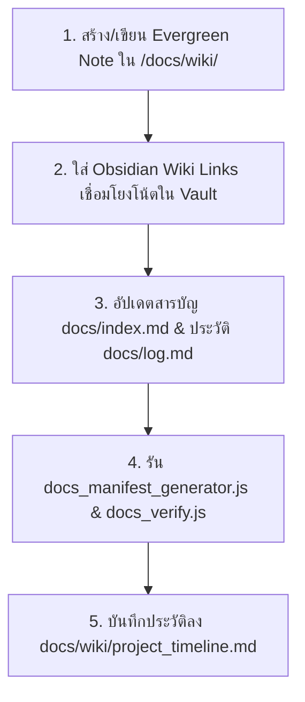

# 📚 Librarian OKF Protocol (คู่มือปฏิบัติการบรรณารักษ์)

ทักษะและกฎการทำงานมาตรฐานสำหรับ **Qoder** และ **AI Agents** ทุกตัวในโครงการ **Hotel-ECS** เพื่อรักษาระเบียบโครงสร้างความรู้ (Knowledge Architecture) ตามมาตรฐาน **OKF (Open Knowledge Format)**

---

## 🛑 กฎเหล็กการจัดวางเอกสาร (Workspace Root Cleanliness)

1. **ห้ามสร้างไฟล์ `.md` หรือเอกสารสรุปคู่มือที่ Workspace Root โดยเด็ดขาด**:
   - อนุญาตเฉพาะไฟล์ระบบหลักที่ระบุไว้ ได้แก่ `README.md`, `AGENTS.md`, และ `Program.md` เท่านั้น
   - **ห้าม** สร้างไฟล์ประเภท `SETUP.md`, `QUICK_REFERENCE.md`, `HOTFIX_GUIDE.md`, `ARCHITECTURE.md` ฯลฯ ไว้ที่ Root Workspace
2. **ปลายทางที่ถูกต้องสำหรับเอกสารความรู้ทั้งหมด**:
   - บันทึกคู่มือ, การวิเคราะห์ปัญหา, สถาปัตยกรรม, หรือสรุปผลงาน **ต้องสร้างไว้ในโฟลเดอร์ `/docs/wiki/` เสมอ**
   - ไฟล์ดิบที่ดึงมาจากภายนอกหรือบันทึกชั่วคราว **ต้องวางไว้ใน `/docs/raw/`** และทำการสกัด (Distill) เข้าสู่ `/docs/wiki/` ก่อนย้ายไฟล์ดิบไปที่ `/docs/raw/archive/`

---

## 🔄 ขั้นตอนปฏิบัติเมื่อมีการสร้างหรืออัปเดตเอกสาร (Librarian Workflow)

เมื่อใดก็ตามที่ Agent/Qoder พัฒนาฟีเจอร์ แก้ไขบั๊ก หรือสร้างคู่มือ ให้ปฏิบัติตาม 5 ขั้นตอนนี้อย่างเคร่งครัด:



1. **[Write Wiki Note]**: 
   - สร้างไฟล์ใน `/docs/wiki/<slug_name>.md` ภาษาไทย ใส่ YAML Frontmatter (`title`, `type: wiki`, `tags`, `created`, `updated`)
2. **[Inter-linking]**:
   - ใช้รูปแบบ Obsidian Wiki Links `[[wiki/target_note|คำแสดงผล]]` หรือ `[[target_note]]` เพื่อสร้าง Knowledge Graph ทั้ง Vault
3. **[Index & Log Update]**:
   - เพิ่มลิงก์ไฟล์ใหม่ลงในหมวดหมู่ที่เหมาะสมของ `docs/index.md`
   - บันทึกแถบประวัติลงในตาราง `docs/log.md`
4. **[World Model Verification]**:
   - หากมีการแตะต้องหรือย้ายไฟล์ใน `/docs/raw/` ให้รันคำสั่ง:
     ```bash
     node scripts/agent_tools/docs_manifest_generator.js
     node scripts/agent_tools/docs_verify.js
     ```
   - ต้องมั่นใจว่าผลลัพธ์คืนค่า **Verification Successful 100%**
5. **[Timeline Audit]**:
   - อัปเดตประวัติการก่อสร้างโครงการลงใน `docs/wiki/project_timeline.md`

---

## 🧹 การเคลียร์ไฟล์ชั่วคราวจากการพัฒนา (Development Cleanup Rule)

- ไฟล์ Log ชั่วคราว (`.txt`, `.log`), ไฟล์บีบอัด (`.zip`), ไฟล์สคริปต์ทดสอบชั่วคราวที่สร้างขึ้นใน Root **ต้องถูกลบทิ้งเมื่อเสร็จสิ้นภารกิจ**
- ห้าม Commit หรือปล่อยไฟล์ขยะทิ้งไว้ใน Git Root
