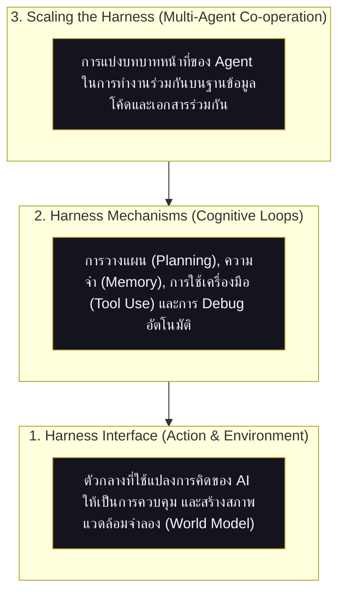

# 🧠 คู่มือสถาปัตยกรรม Code as Agent Harness (Hotel ECS)

เอกสารฉบับนี้จัดทำขึ้นเพื่อบันทึก **แก่นเชิงทฤษฎีจากงานวิจัย "Code as Agent Harness" (arXiv 2605.18747)** และวิเคราะห์เปรียบเทียบการจับคู่เชิงโครงสร้าง (Structural Mapping) เข้ากับ **ระบบควบคุมไฟฟ้าโรงแรม (Hotel ECS)** เพื่อยกระดับระบบสู่ **Agent-Operable System** ที่แท้จริง

---

## 🔬 แก่นสำคัญของกรอบแนวคิด "Code as Agent Harness"

งานวิจัย Survey นี้เสนอการเปลี่ยนแปลงกระบวนทัศน์ (Paradigm Shift) ในการมองความสัมพันธ์ระหว่าง AI Agent และโค้ด:

> [!IMPORTANT]
> **โค้ด (Code) ไม่ได้เป็นเพียง "ผลลัพธ์ (Output)"** ที่โมเดล AI สร้างขึ้นมาเฉยๆ อีกต่อไป แต่กลายเป็น **"โครงสร้างบังคับ (Harness)"** ที่สามารถรันได้จริง (Executable), ตรวจสอบสถานะได้ (Inspectable) และเก็บสถานะได้ (Stateful) ซึ่ง Agent ใช้สวมใส่หรือเชื่อมต่อเพื่อดำเนินการใช้เหตุผล (Reason), สั่งการควบคุม (Act), จำลองสิ่งแวดล้อม (Model), รับฟีดแบ็ก (Feedback Loop) และประสานงานกัน

โดยแบ่งสถาปัตยกรรมของ Harness ออกเป็น **3 ชั้นหลัก** ดังนี้:

1. **Harness Interface**: โค้ดทำหน้าที่เป็นตัวกลางให้ Agent สั่งการควบคุมระบบภายนอก หรือสร้างแบบจำลองสภาพแวดล้อมเพื่อจำลองสิ่งที่จะเกิดขึ้นล่วงหน้า (World Model)
2. **Harness Mechanisms**: กลไกการทำงานของ Agent ภายในโค้ด ได้แก่ ระบบการวางแผน (Planning), คลังความจำ (Memory), การเลือกใช้เครื่องมือ (Tool Use) และวงจรการแก้ไขโค้ดเมื่อพบ Error (Feedback/Debugging Loop)
3. **Scaling the Harness**: การขยายขีดความสามารถโดยใช้ Agent หลายตัว (Multi-Agent) ร่วมกันจัดการ ทำงาน ตรวจสอบ และเขียนโค้ด/เอกสารบน Repository เดียวกัน

---

## 🏨 การจับคู่กรอบแนวคิดเข้ากับโปรเจกต์ Hotel ECS

โปรเจกต์ Smart Hotel Self Check-in ของเราถูกวางรากฐานและโครงสร้างที่สอดคล้องตามหลักการของ Harness Paper นี้ทุกประการ:

### 1. Digital Twin = "Code for Environment Modeling" (ตรงกัน 100%)
- **ทฤษฎีใน Paper**: การใช้โค้ดจำลองความเคลื่อนไหวและร่องรอยการสั่งงาน (Execution-trace World Modeling) เพื่อให้มีสภาพแวดล้อมจำลองที่ปลอดภัยก่อนลงมือจริง
- **การประยุกต์ใช้จริง**: บอร์ดจำลอง **Mock PBX Server** และ **Virtual Relays** ในโครงสร้างระบบจำลองของเรา (Digital Twin) คือสภาพแวดล้อมที่ **Inspectable** (สามารถสืบค้น ค้นหาประวัติ และจำลอง Error) เพื่อให้แอดมินและ Agent ย่อย ทดสอบและรัน E2E ได้ 1,000 ครั้งอย่างปลอดภัยก่อนเปลี่ยนสลับไปควบคุมบอร์ดควบคุม 220V ของจริง

### 2. docs/ (คลังข้อมูล OKF) = "Repository as a Persistent Program World"
- **ทฤษฎีใน Paper**: การเก็บข้อมูลการเปลี่ยนแปลงแบบถาวร เพื่อให้ Agent หลายตัวอ่านและอ้างอิงเป็นความจำระยะยาวร่วมกัน (Shared Repository State)
- **การประยุกต์ใช้จริง**: การใช้โฟลเดอร์ `/docs` (มาตรฐาน OKF) โดยแบ่งเป็น:
  - **Working Memory**: ไฟล์ร่างดิบใน `/docs/raw` ที่รอการตรวจสอบ
  - **Persistent Memory**: คลังความรู้ถาวรใน `/docs/wiki` (Evergreen Notes) และประวัติระบบใน `log.md`
  - มีการกำกับความสมบูรณ์และป้องกันข้อมูลบิดเบือนด้วยกลไกตรวจสอบลายเซ็นดิจิทัล `MANIFEST.sha256` ทุกครั้ง

### 3. Functional Role Specialization (สถาปัตยกรรม Agent ย่อย)
- **ทฤษฎีใน Paper**: การแยกหน้าที่ทำงานเพื่อป้องกันปัญหา AI ดึงข้อมูลและเขียนสรุปสับสนปนเปกันเอง (Misattribution)
- **การประยุกต์ใช้จริง**: ระบบแบ่งบทบาทหน้าที่ของ Librarian Agent ออกเป็น 2 ตัวหลัก:
  - **Synthesis Agent**: สแกนหาไฟล์ดิบเพื่อทำการเรียบเรียงและร่างเนื้อหา (Draft)
  - **Verification Agent**: ทำการตรวจสอบลายเซ็น Checksum ความโปร่งใส ตรวจสอบความถูกต้องของภาษา และอนุมัติการบันทึกถาวรลงใน Wiki เพื่อตัดวงจรการสรุปข้อมูลผิดพลาด

### 4. Test-Gated Convergence (เกณฑ์การผ่านเฟสการทำงาน)
- **ทฤษฎีใน Paper**: การประยุกต์ใช้ฟีดแบ็กและผลลัพธ์การทดสอบโค้ด (Feedback-driven control) เพื่อตัดสินความเสร็จสิ้นสมบูรณ์
- **การประยุกต์ใช้จริง**: การตั้งเกณฑ์ผ่านระดับเฟส เช่น การควบคุมสวิตช์รีเลย์ไฟจะต้องผ่านการทดสอบจำลอง N=1,000 ครั้งติดต่อกันโดยปราศจาก Error ใดๆ และการทดสอบ E2E ความเข้ากันได้ของ Serial port ก่อนที่จะได้รับอนุญาตให้ขยับโครงสร้างจาก Dry-run เป็น Live Mode (ควบคุมไฟฟ้าจริง)

---

## 📈 แผนพัฒนาสู่ Agent-Operable System (Roadmap)

ในอนาคต ระบบ Hotel ECS จะถูกพัฒนาต่อยอดโดยยึดตามหลักการนี้:
- **Harness Observability**: ปรับโครงสร้าง Application Logs ให้มี Trace ID และ Snapshot เพื่อให้บอทตรวจสอบหาสาเหตุ Error และประมวลผลการทำงานได้เองอย่างอิสระ
- **Safety Gate**: ตรึงกลไกการอนุมัติคำสั่งเสี่ยงสูง (High-Risk Approval) ผ่าน Telegram Bot และ Web Dashboard เพื่อทำหน้าที่เป็นเกณฑ์การควบคุมโดยมีมนุษย์ในวงจร (Human-in-the-loop) เป็นหลักเลี่ยงไม่ได้

---
*จัดทำบันทึกและอนุมัติโดย: Librarian Agent (Antigravity)*
*บันทึกอ้างอิง: [Awesome Code as Agent Harness Papers](https://github.com/YennNing/Awesome-Code-as-Agent-Harness-Papers)*
