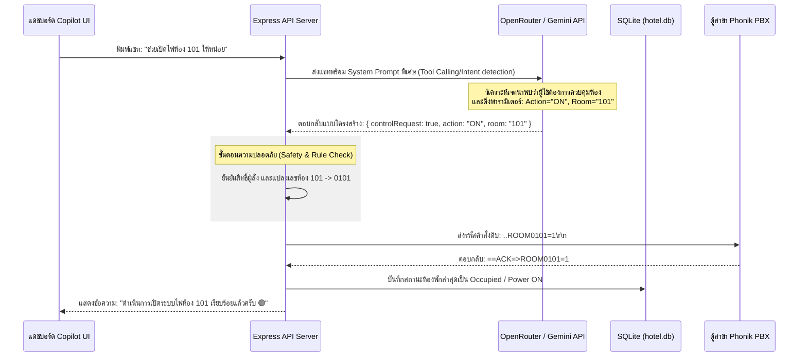
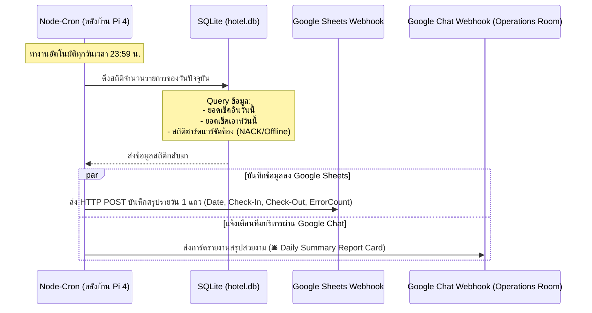

# 🛠️ แผนการพัฒนาฟีเจอร์ AI Control (สั่งงานผ่านแชท) & Daily Operations Report (สรุปยอดประจำวัน)

เอกสารฉบับนี้กำหนดรายละเอียด **Workflow & System Design** สำหรับการพัฒนาฟีเจอร์ขั้นสูงถัดไป เพื่อเตรียมพร้อมสำหรับการลงมือเขียนโค้ดจริงในเซสชันหน้าครับ

---

## 🧠 ฟีเจอร์ที่ 1: AI Control (การควบคุมไฟฟ้าและฮาร์ดแวร์ผ่านห้องแชท)

### 🔄 แผนผังขั้นตอนการทำงาน (Workflow Process)

### 🛠️ สิ่งที่จะต้องพัฒนาในโค้ด:
1.  **System Prompt Tuning:** เพิ่มคำอธิบายใน `systemPrompt` ของ Copilot ให้รองรับการตรวจจับข้อความคำสั่ง และตอบกลับในรูปแบบ JSON เพื่อให้ Backend แกะพารามิเตอร์ไปสั่งงานต่อได้ง่าย (Intent Detection)
2.  **Command Safety Gate:** สร้างฟังก์ชันป้องกันและตรวจสอบค่าตัวแปร (Input validation) ก่อนส่งต่อให้ PBX Connector เช่น การตัดช่องว่าง, ตรวจสอบช่วงเลขห้องจริง และการจำกัดสิทธิ์เฉพาะบัญชีช่าง/พนักงาน (Role Authorization)
3.  **PBX Direct Call Integration:** นำโมดูล `pbx.sendCommand` มาผูกเข้ากับผลลัพธ์ของ Copilot API เพื่อยิงคำสั่งเปิด/ปิดไฟฟ้าห้องจริงในลูปเดียว

---

## 📊 ฟีเจอร์ที่ 2: Daily Operations Report (การส่งรายงานสรุปยอดและปัญหาประจำวัน)

### 🔄 แผนผังขั้นตอนการทำงาน (Workflow Process)

### 🛠️ สิ่งที่จะต้องพัฒนาในโค้ด:
1.  **Scheduler Module:** ติดตั้งแพ็กเกจ `node-cron` หรือสร้างฟังก์ชัน `setInterval` เฝ้าระวังเวลา 23:59 บนเครื่อง Pi 4 หลังบ้าน
2.  **Aggregation Queries:** เขียน SQL Queries สำหรับสรุปสถิติประจำวัน เช่น:
    - `SELECT COUNT(*) FROM bookings WHERE date(check_in_time) = date('now')`
    - `SELECT COUNT(*) FROM system_logs WHERE level = 'ERROR' AND date(timestamp) = date('now')`
3.  **Chat Card Formatter:** ออกแบบการ์ดรายงานประจำวัน (Daily Summary Card) ในรูปแบบ JSON เพื่อส่งผ่าน Google Chat Webhook แสดงสถิติตัวเลขสวยงามพร้อมไฟสถานะเขียว/แดงเพื่อรายงานภาพรวมให้ผู้บริหารโรงแรมทราบแบบเรียลไทม์
