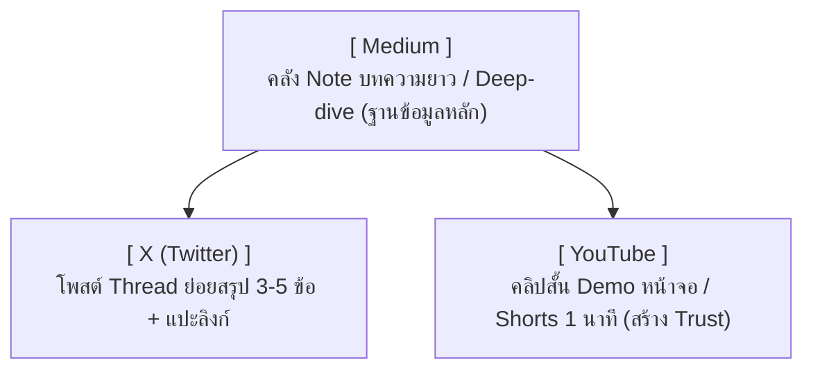

# 📢 พิมพ์เขียวระบบสื่อสาร 3 ช่องทางหลัก (Build in Public Strategy)

เอกสารฉบับนี้เป็น Evergreen Note สรุปกลยุทธ์การสื่อสาร การเผยแพร่ผลงาน และการส่งต่อองค์ความรู้ (Knowledge Transfer) ของโครงการ **Hotel-ECS** ผ่านแนวคิด **Build in Public** โดยแบ่งโครงสร้างสื่อออกเป็น 3 ช่องทางหลักเพื่อสร้างการรับรู้ ความน่าเชื่อถือ และเป็นคู่มือสอนทีมช่างในอนาคต

---

## 📐 โครงสร้างระบบสื่อสาร 3 ช่องทาง (3-Channel Pipeline)

---

## 📋 รายละเอียดเวิร์กโฟลว์การทำงาน (Action Steps)

### 1. **Medium (คลังบทความเชิงลึก & Knowledge Base)**
- **บทบาท**: บันทึกการแก้ปัญหาเชิงวิศวกรรม เช่น [[wiki/troubleshooting|การแก้ปัญหา PBX EHOSTUNREACH]] หรือ [[wiki/cloudflare_tunnel_setup|การติดตั้ง Cloudflare Tunnel บน Pi 4]]
- **องค์ประกอบ**:
  - หัวข้อปัญหาและภาพรวมสถาปัตยกรรม
  - โค้ด / คำสั่ง / Prompt ที่ใช้แก้ปัญหาจริง
  - สรุปบทเรียน (Key Takeaways) และผลลัพธ์
- **ประโยชน์**: ทำหน้าที่เป็น Note ความรู้สาธารณะที่ค้นคืนง่าย และติดอันดับใน Google Search

### 2. **X / Twitter (กระจัดข่าวสั้น & Thread)**
- **บทบาท**: สรุปจุดพีค 3-5 ข้อจาก Medium หรือบันทึกเหตุการณ์สำคัญจาก [[wiki/project_timeline|Project Timeline]]
- **องค์ประกอบ**:
  - **Hook**: ประโยคดึงดูดสายตา (เช่น *"3 เทคนิคแก้ไขปัญหา IP ชนกันบน Raspberry Pi 4 สไตล์ Industrial IoT"*)
  - **Thread Body**: เขียนสรุปกระชับ 3-5 ทวีต
  - **Call to Action**: แปะลิงก์อ่านฉบับเต็มบน Medium และวิดีโอ YouTube

### 3. **YouTube Clips / Shorts (สาธิตใช้งานจริง)**
- **บทบาท**: อัดหน้าจอการทำงาน 1-3 นาที หรือ Shorts ไม่เกิน 60 วินาที แสดงการทำงานจริงของ [[wiki/liff-checkin-process|LINE Self Check-in]] และตู้สาขา Phonik PBX
- **องค์ประกอบ**: เน้น **"ทำจริง เห็นผลจริง"** (Real Hardware & UI Action) เพื่อสร้างความเชื่อมั่นแก่ช่างโรงแรมและผู้ใช้งาน

---

## 🎯 กฎเหล็กสร้างความยั่งยืน (Golden Rules)

1. **Focus > Quantity**: ทำ 3 ช่องทางนี้ให้ต่อเนื่องก่อนจะขยายไปยังแพลตฟอร์มอื่น
2. **Build in Public**: นำเสนอในฐานะ *"การทดลองและสร้างสรรค์ร่วมกัน"* อย่างตรงไปตรงมา
3. **Reuse Everything**: องค์ความรู้ 1 เรื่องจาก [[wiki/project_timeline|Timeline]] ต้องแปลงเป็น Medium, X Thread และ YouTube Video เพื่อประหยัดพลังงาน

---

## 🔗 โน้ตที่เกี่ยวข้อง (Related Notes)
- [[wiki/project_timeline|📅 TimeLine ประวัติการก่อสร้างโครงการ Hotel-ECS]]
- [[wiki/youtube_storytelling|คู่มือการสร้าง Storytelling และคลิปวิดีโอ]]
- [[wiki/user_operation_manual|คู่มือการใช้งานระบบ (User Operation Manual)]]
- [[wiki/solo_dev_business_strategy|กลยุทธ์ธุรกิจสำหรับ Solo Developer]]
