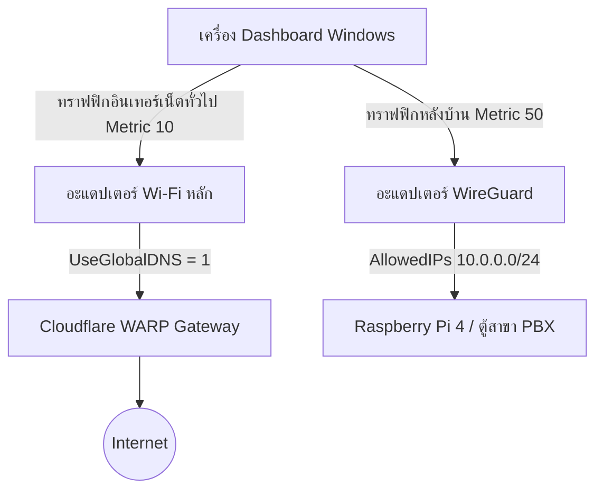

# 📋 SOP มาตรฐานการตั้งค่าเครือข่ายเครื่อง Dashboard (การติดตั้งใหม่)
เอกสารฉบับนี้ใช้สำหรับ **ทีมช่างเทคนิคและผู้ดูแลระบบ** เพื่อเตรียมระบบเครือข่ายของเครื่องคอมพิวเตอร์แอดมิน (Dashboard Client) ที่ติดตั้งใหม่ทุกเครื่องที่มีการรันโปรแกรม **WireGuard VPN** ควบคู่ไปกับ **Cloudflare WARP (Zero Trust Client)** เพื่อป้องกันปัญหา Wi-Fi หลุดสลับและปัญหาไอคอน VPN หายอย่างถาวร

---

## 1. 🔍 ความสำคัญของกระบวนการนี้ (Why This Matters)
เมื่อรัน Cloudflare WARP ร่วมกับ WireGuard บน Windows จะเกิดการแย่งชิงสิทธิ์ในการควบคุม DNS และ Routing Table เสมอ:
1. **Cloudflare WARP** จะดึง DNS ไปชี้ที่ `127.0.2.2` (Loopback) เพื่อกรองข้อมูลผ่านระบบ Cloudflare Gateway
2. **WireGuard** จะสร้างอะแดปเตอร์เครือข่ายเสมือนเพื่อเชื่อมต่อวงใน (`10.0.0.0/24`) ไปยังบอร์ด Pi 4 และตู้สาขา
3. **ผลกระทบ:** Windows NCSI (ตัวตรวจเช็คเน็ต) จะค้างและคิดว่าอินเทอร์เน็ตล่ม จึงสั่งรีเซ็ตชิป Wi-Fi ดรอปการเชื่อมต่อชั่วคราวเป็นระยะๆ ส่งผลให้หน้าแดชบอร์ดที่ควบคุมห้องพักหลุดทันที

การจัดแจง Registry และปรับตั้งค่าลำดับความสำคัญ (Interface Metric) จะเป็นการช่วยให้ Windows ทราบเส้นทางอย่างชัดเจนว่า **"อินเทอร์เน็ตทั่วไปให้วิ่งผ่าน Wi-Fi หลัก และทราฟฟิกหลังบ้านให้วิ่งแยกเข้าช่อง VPN ของ WireGuard"** โดยไม่มีการแย่งชิงหรือตัดสัญญาณกันเอง

---

## 2. 🛠️ แผนภาพสถาปัตยกรรมระบบเครือข่าย (Network Architecture)



---

## 3. 📋 ขั้นตอนการตั้งค่าเครือข่ายเมื่อติดตั้งเครื่องใหม่ (Step-by-Step SOP)

### ขั้นตอนที่ 1: ติดตั้งโปรแกรมพื้นฐาน
1. ติดตั้ง **Cloudflare WARP Client (Zero Trust)** และลงทะเบียนบัญชีองค์กรให้เสร็จสิ้น
2. ติดตั้ง **WireGuard Windows Client** และนำเข้าไฟล์คอนฟิกูเรชัน `hotel-admin.conf`

### ขั้นตอนที่ 2: รันสคริปต์ปรับแต่งเครือข่ายอัตโนมัติ (PowerShell Admin)
1. คลิกขวาที่ปุ่ม Start ของ Windows เลือก **Terminal (Admin)** หรือ **PowerShell (Admin)**
2. เรียกใช้งานสคริปต์ซ่อมบำรุงเครือข่ายประจำโครงการ:
   ```powershell
   powershell -NoProfile -ExecutionPolicy Bypass -File "C:\Users\Nithep\ไดรฟ์ของฉัน (cnithep@gmail.com)\Hotel-ECS\scripts\network_fix.ps1"
   ```
3. สคริปต์จะทำการเขียนนโยบายบังคับใช้ Global DNS ปิดโปรเซสที่ค้าง และปรับแต่ง Metric การ์ด Wi-Fi ให้ถูกต้องอัตโนมัติ

### ขั้นตอนที่ 3: ตรวจสอบความถูกต้องหน้างาน
1. **เช็คสถานะ Wi-Fi:** ไอคอน Wi-Fi ต้องแสดงผลปกติ (ไม่มีเครื่องหมายตกใจสีเหลือง และเน็ตเวิร์กไม่มีอาการหลุดต่อใหม่)
2. **เช็คสถานะ WireGuard GUI:** ไอคอนมังกรต้องแสดงผลใน System Tray (มุมขวาล่างข้างนาฬิกา) และสามารถกด `Activate` เป็นสีเขียวเชื่อมต่อสำเร็จ
3. **เช็คการสื่อสารภายใน:** เปิด PowerShell แล้วพิมพ์คำสั่งเพื่อทดสอบเชื่อมโยงไปยังบอร์ด Pi 4:
   ```powershell
   ping 10.0.0.1
   ```
   *(ต้องได้รับสัญญาณตอบกลับแบบ 0% Packet Loss)*

---

## 4. 🗃️ การบันทึกประวัติและแนวทางกู้คืนปัญหาฉุกเฉิน (Troubleshooting SOP)

| อาการที่พบหน้างาน | สาเหตุที่แท้จริง | ขั้นตอนการเยียวยาระบบ (Self-Healing) |
| :--- | :--- | :--- |
| **Wi-Fi หลุดบ่อย หน้าจอค้าง** | Windows NCSI เช็คอินเทอร์เน็ตผ่าน DNS Loopback ล้มเหลวและสั่งรีเซ็ต Wi-Fi | เปิด PowerShell (Admin) และตรวจสอบคีย์ Registry `UseGlobalDNS` ต้องตั้งเป็น `1` |
| **ฟ้อง Error "Manager already installed"** | ตัวโปรแกรม GUI ของ WireGuard รันซ้อนกันหรือค้างอยู่เบื้องหลัง | เปิด Task Manager ปิดโปรเซส `wireguard.exe` ทั้งหมด หรือรันสคริปต์ `network_fix.ps1` เพื่อรีเซ็ต |
| **WireGuard ขาดการเชื่อมต่อบ่อย** | สลับเราเตอร์หน้างาน หรือ Gateway ของ WARP เข้ามาขัดขวางเส้นทางพอร์ต | ตรวจสอบในหน้า Cloudflare Zero Trust Profile ว่ามี IP `10.0.0.0/8` อยู่ในรายการ **Split Tunnels (Exclude Mode)** |
