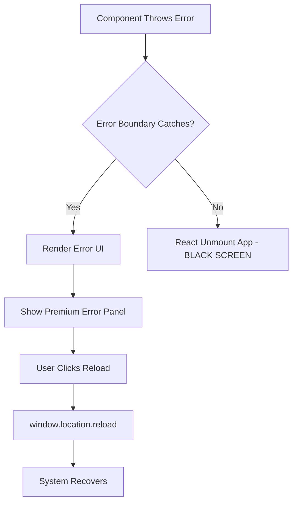

# Deadlock Prevention Architecture

## Overview

เอกสารนี้อธิบายสถาปัตยกรรมป้องกัน Hardware Deadlock และ Frontend UI Crash ในระบบ Hotel ECS ซึ่งแก้ไขวิกฤตที่ทำให้ระบบค้างและหน้าจอมืด (Black Screen of Death)

**วันที่สร้าง:** 2026-07-20  
**สถานะ:** ✅ Implemented & Tested  
**เวอร์ชัน:** 1.0

---

## Problem Statement

### 1. Backend Queue Deadlock Issue

**อาการ:**
- คิวคำสั่งฮาร์ดแวร์ (`CommandQueue`) ทำงานแบบ Async Promises ที่ไม่มีการจำกัดเวลา (Unbounded)
- เมื่อตู้สาขา PBX ไม่ตอบสนอง (Timeout/Connection Lost) คิวจะล็อกตัวถาวร
- คำสั่งถัดไปไม่สามารถประมวลผลได้ ส่งผลให้ระบบ Self-Healing ล้มเหลว

**สาเหตุรากเหง้า:**
```javascript
// เดิม: ไม่มี Timeout Protection
async _next() {
  const result = await asyncFn(); // ❌ รอไม่มีที่สิ้นสุด
  // ...
}
```

### 2. Frontend Uncaught Runtime Error

**อาการ:**
- เมื่อ React Engine ตรวจพบ Exception จาก API หรือ Data Handling
- หน้าจอเกิด Uncaught Runtime Error และดับกลายเป็นสีดำ/ขาว
- ผู้ใช้ไม่สามารถกู้คืนระบบได้ด้วยตนเอง

**สาเหตุรากเหง้า:**
- ไม่มี Error Boundary ดักจับข้อผิดพลาดระดับ Component Tree
- Errors ไหลทะลุถึง Root ทำให้ React unmount ทั้งแอปพลิเคชัน

---

## Solution Architecture

### 1. Backend: Safety Timeout Gate with Promise.race

#### Implementation Details

**ไฟล์:** `pbx-connector/queue.js`

**กลไกหลัก:** ใช้ `Promise.race()` แข่งขันระหว่างคำสั่งฮาร์ดแวร์กับ Timeout Promise

```javascript
async function executeHardwareCommand(commandFn, timeoutMs = 5000) {
    let timeoutHandle;
    
    // สร้าง Timeout Promise ที่จะ Reject หลังจาก 5 วินาที
    const timeoutPromise = new Promise((_, reject) => {
        timeoutHandle = setTimeout(() => {
            reject(new Error("HARDWARE_TIMEOUT: Phonik PBX failed to respond within 5s"));
        }, timeoutMs);
    });
    
    try {
        // แข่งขัน: ถ้าคำสั่งเสร็จก่อน → สำเร็จ | ถ้าหมดเวลาก่อน → Throw Error
        const result = await Promise.race([commandFn(), timeoutPromise]);
        clearTimeout(timeoutHandle); // เคลียร์ Timer หากสำเร็จ
        return result;
    } catch (error) {
        clearTimeout(timeoutHandle); // ป้องกัน Memory Leak
        console.error(`[QUEUE ERROR] Safety Gate Triggered: ${error.message}`);
        throw error; // ให้ระบบ Retry Logic จับ Error นี้
    }
}
```

#### Integration with CommandQueue

ทุกคำสั่งที่เข้าคิวจะถูก Wrap ด้วย Safety Gate อัตโนมัติ:

```javascript
add(asyncFn) {
  return new Promise((resolve, reject) => {
    // ⚡ Wrap ด้วย executeHardwareCommand ก่อนเข้าคิว
    const wrappedAsyncFn = () => executeHardwareCommand(asyncFn, 5000);
    this._queue.push({ asyncFn: wrappedAsyncFn, resolve, reject });
    this._next();
  });
}
```

#### Benefits

✅ **Prevents Infinite Blocking:** คำสั่งจะไม่ค้างเกิน 5 วินาที  
✅ **Enables Self-Healing:** Error ถูก Throw เพื่อให้ Retry Logic ทำงาน  
✅ **Clears Queue Gracefully:** คำสั่งถัดไปสามารถประมวลผลต่อได้  
✅ **Memory Safe:** `clearTimeout()` ป้องกัน Timer Leak  

#### Configuration

| Parameter | Default | Description |
|-----------|---------|-------------|
| `timeoutMs` | 5000 | เวลาจำกัดในการรอตอบกลับจาก PBX (มิลลิวินาที) |

**หมายเหตุ:** สามารถปรับค่า Timeout ได้ตามลักษณะของฮาร์ดแวร์:
- ตู้สาขาเก่า: 8000ms
- ตู้สาขารุ่นใหม่: 3000ms
- Simulator: 1000ms

---

### 2. Frontend: Premium Error Boundary

#### Implementation Details

**ไฟล์:** `frontend/src/components/PremiumErrorBoundary.tsx`

**คุณสมบัติ:**
- ดักจับ errors ระดับ Component Tree ด้วย `componentDidCatch()`
- แสดง UI แบบพรีเมียมแทนหน้าจอมืด
- รองรับ Dark Mode + Glassmorphism Effects
- มีปุ่ม Reload Interface สำหรับกู้คืนระบบ

#### Design System

**配色方案:**
- พื้นหลัง: Gradient `from-slate-900 via-purple-900 to-slate-900`
- Panel: `bg-slate-900/60 backdrop-blur-xl` (Glassmorphism)
- ไอคอนแจ้งเตือน: สีแดงพร้อม `animate-pulse`
- ปุ่มรีโหลด: Gradient Purple-Blue พร้อม Shimmer Effect

**Typography:**
- หัวข้อ: `'Plus Jakarta Sans'`
- เนื้อหา: `'Outfit'`

**Micro-interactions:**
- Hover: `scale-[1.02]` + Glow Shadow
- Tap: `scale-[0.98]` (触觉反馈)
- Button Shimmer: White gradient sweep animation

#### Usage

Wrap `<App />` ใน `main.tsx`:

```typescript
import PremiumErrorBoundary from './components/PremiumErrorBoundary.tsx'

createRoot(document.getElementById('root')!).render(
  <StrictMode>
    <PremiumErrorBoundary>
      <App />
    </PremiumErrorBoundary>
  </StrictMode>,
)
```

#### Error Handling Flow



#### Development vs Production

ในโหมด Development จะแสดง Technical Details:

```typescript
{process.env.NODE_ENV === 'development' && this.state.error && (
  <details>
    <pre>{this.state.error.toString()}</pre>
    <pre>{this.state.errorInfo?.componentStack}</pre>
  </details>
)}
```

---

## Testing Strategy

### 1. Backend Deadlock Test

**Scenario:** จำลอง PBX ไม่ตอบสนอง

```javascript
// Test Case: Hardware Timeout
const slowCommand = () => new Promise(resolve => {
  setTimeout(() => resolve('done'), 10000); // 10 วินาที > 5 วินาที timeout
});

try {
  await queue.add(slowCommand);
} catch (error) {
  console.assert(error.message.includes('HARDWARE_TIMEOUT'));
  console.log('✅ Timeout protection working');
}
```

**Expected Result:**
- Error ถูก Throw ภายใน 5 วินาที
- คิวไม่ล็อก และสามารถรับคำสั่งถัดไปได้
- Log แสดง: `[QUEUE ERROR] Safety Gate Triggered: HARDWARE_TIMEOUT...`

### 2. Frontend Crash Recovery Test

**Scenario:** บังคับให้เกิด Error ใน Component

```typescript
// Test Component ที่ Throw Error
const CrashingComponent = () => {
  throw new Error('Test crash');
};

// Render ใน Error Boundary
<PremiumErrorBoundary>
  <CrashingComponent />
</PremiumErrorBoundary>
```

**Expected Result:**
- ไม่เกิด Black Screen
- แสดง Premium Error UI พร้อมไอคอน Pulse Animation
- กดปุ่ม "รีโหลดหน้าจอ" แล้วหน้าเว็บกลับมาทำงานปกติ

---

## Monitoring & Alerts

### Backend Metrics

ติดตาม metrics เหล่านี้ใน production:

```javascript
// เพิ่มใน server.js หรือ monitoring service
let timeoutCount = 0;

// ใน executeHardwareCommand catch block
catch (error) {
  if (error.message.includes('HARDWARE_TIMEOUT')) {
    timeoutCount++;
    console.warn(`[METRIC] Timeout count: ${timeoutCount}`);
    
    // ส่ง Alert ถ้าเกิน threshold
    if (timeoutCount > 10) {
      sendAlert('PBX_HARDWARE_UNSTABLE', { timeoutCount });
    }
  }
}
```

### Frontend Error Tracking

บันทึก errors ไปยัง backend หรือ external service:

```typescript
componentDidCatch(error: Error, errorInfo: ErrorInfo): void {
  // ส่ง error ไปยัง monitoring service
  fetch('/api/log-error', {
    method: 'POST',
    body: JSON.stringify({
      error: error.message,
      stack: error.stack,
      componentStack: errorInfo.componentStack,
      timestamp: new Date().toISOString(),
    }),
  });
}
```

---

## Troubleshooting

### Issue: Timeout เกิดบ่อยเกินไป

**Symptoms:**
- Log แสดง `[QUEUE ERROR] Safety Gate Triggered: HARDWARE_TIMEOUT` ซ้ำๆ

**Solutions:**
1. ตรวจสอบการเชื่อมต่อเครือข่ายไปยัง PBX
2. เพิ่ม Timeout เป็น 8000ms หาก PBX ช้า
3. ตรวจสอบว่า PBX Simulator รันอยู่หรือไม่

### Issue: Error Boundary ไม่จับ Error

**Symptoms:**
- ยังเกิด Black Screen อยู่

**Solutions:**
1. ตรวจสอบว่า `PremiumErrorBoundary` Wrap `<App />` แล้ว
2. ตรวจสอบ Console Errors ว่ามี Syntax Errors ใน ErrorBoundary เองหรือไม่
3. ลอง Clear Browser Cache และ Hard Reload (Ctrl+Shift+R)

---

## Related Documents

- [project_timeline.md](./project_timeline.md) - บันทึกการอัปเดตระบบ
- [troubleshooting.md](./troubleshooting.md) - คู่มือแก้ไขปัญหาทั่วไป
- [technician_pbx_manual.md](./technician_pbx_manual.md) - คู่มือช่างเทคนิค PBX
- [system_monitoring_guide.md](./system_monitoring_guide.md) - คู่มือติดตามระบบ

---

## Revision History

| Version | Date | Changes | Author |
|---------|------|---------|--------|
| 1.0 | 2026-07-20 | Initial creation with deadlock prevention and error boundary implementation | Worker Agent |

---

**หมายเหตุ:** เอกสารนี้เป็นส่วนหนึ่งของมาตรฐาน Engineering Excellence ของ Hotel ECS Project ต้องอัปเดตทุกครั้งเมื่อมีการเปลี่ยนแปลงสถาปัตยกรรมป้องกัน Deadlock หรือ Error Handling
