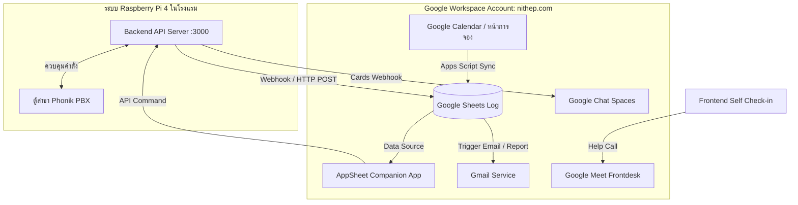

# 💼 คู่มือการบูรณาการระบบ Hotel-ECS ร่วมกับ Google Workspace

เอกสารนี้อธิบายแนวทางและขั้นตอนการเชื่อมต่อระบบ **Hotel-ECS Smart Check-in/Check-out** เข้ากับบริการในระบบนิเวศของ **Google Workspace** (อ้างอิงจากบริการที่คุณเปิดใช้งานในหน้า Admin Console เช่น AppSheet, Google Chat, Gmail, Google Calendar และ Google Meet) เพื่อเพิ่มความสะดวกในการทำงานของพนักงานและยกระดับความพึงพอใจของแขกผู้เข้าพัก

---

## 🗺️ ภาพรวมสถาปัตยกรรมการบูรณาการ (Integration Architecture)

---

## 1. 📊 Google Sheets + AppSheet (แอปพลิเคชันพนักงานบนมือถือ)
**AppSheet** คือเครื่องมือสร้าง No-code Application ที่เหมาะสำหรับให้พนักงานต้อนรับ (Front Desk) และแม่บ้าน (Housekeeping) ใช้ตรวจสอบสถานะห้องพักบนแท็บเล็ตหรือมือถือ

### ขั้นตอนการบูรณาการ:
1. **เชื่อมต่อฐานข้อมูล**: เชื่อมต่อ AppSheet เข้ากับ Google Sheets ที่สร้างไว้ใน [[google_apps_script_setup|คู่มือ Google Sheets & Apps Script]]
2. **สร้างหน้าจอแสดงผล (Views)**:
   - **Live Room Status**: แสดงตารางหมายเลขห้อง สถานะไฟฟ้าปัจจุบัน (ON/OFF) ชื่อผู้เข้าพัก และเวลาเช็คอิน
   - **Uptime Logger**: แสดงบันทึกเหตุการณ์ของระบบ (Activity Logs)
3. **ฟังก์ชันปุ่มคำสั่ง (Action Buttons) สำหรับพนักงาน**:
   - สร้างปุ่ม **"เปิดไฟฉุกเฉิน (Force ON)"** หรือ **"ปิดไฟ (Force OFF)"** บนหน้าจอ AppSheet
   - เมื่อกดปุ่มดังกล่าว AppSheet จะส่งคำสั่งในรูปแบบ **Automation Webhook** กลับมาที่ API Server ของเรา (ผ่าน Cloudflare Tunnel เช่น `https://hotel.nithep.com/api/rooms/control`)
   - ระบบหลังบ้านจะตรวจสอบสิทธิ์และส่งคำสั่งผ่าน PBX Connector เพื่อสั่งรีเลย์ที่ตู้สาขาทันที โดยที่พนักงานไม่ต้องเดินไปที่ตู้ PBX หรือกดจากหน้า Dashboard บนคอมพิวเตอร์

---

## 2. 💬 Google Chat (ระบบแจ้งเตือนแบบการ์ดเรียลไทม์)
ใช้สำหรับส่งแจ้งเตือนสถานะต่างๆ ให้กลุ่มแชทของพนักงานทราบแบบเรียลไทม์ โดยปัจจุบันโค้ดใน [google_notifier.js](file:///c:/Users/Nithep/%E0%B9%84%E0%B8%94%E0%B8%A3%E0%B8%9F%E0%B9%8C%E0%B8%82%E0%B8%AD%E0%B8%87%E0%B8%89%E0%B8%B1%E0%B8%99%20%28cnithep@gmail.com%29/Hotel-ECS/backend/services/google_notifier.js) ได้รับการออกแบบโครงสร้างการ์ด (Card Structure) ไว้แล้ว

### ขั้นตอนการตั้งค่า:
1. **สร้าง Space สำหรับพนักงาน**: สร้างพื้นที่ทำงาน (Space) บน Google Chat เช่น "ECS Hotel Operations"
2. **สร้าง Webhook API**:
   - ไปที่ชื่อห้องแชทด้านบน > **Apps & Integrations (แอปและการผสานรวม)** > **Webhooks**
   - กดเพิ่ม Webhook ตั้งชื่อเป็น "Hotel ECS Bot" ใส่ไอคอนและกดบันทึก
   - คัดลอก URL Webhook ที่ได้รับ
3. **เชื่อมเข้าระบบ**: นำ URL ไปตั้งในไฟล์ `.env` ที่พารามิเตอร์ `GOOGLE_CHAT_WEBHOOK_URL`
4. **สิ่งที่จะได้รับการแจ้งเตือน**:
   - การ์ดเช็คอินแสดงหมายเลขห้องและชื่อแขก (🛎️ New Check-In Alert)
   - การ์ดเช็คเอาท์เมื่อห้องพักถูกตัดไฟ (🚪 Check-Out Alert)
   - *คำแนะนำเพิ่มเติม*: สามารถพัฒนาเพิ่มให้ส่งการ์ดแจ้งเตือนกรณี **"ตู้ PBX ตัดการเชื่อมต่อ (Offline)"** เพื่อให้ช่างเข้าตรวจสอบได้ทันท่วงที

---

## 3. 📅 Google Calendar (สร้างหน้าการจอง - Appointment Schedules)
ใช้ประโยชน์จากความสามารถ **"สร้างหน้าการจอง (Appointment Schedule)"** ใน Google Workspace สำหรับโรงแรมขนาดเล็ก หรือห้องพักพิเศษที่ต้องการให้จองเวลาเช็คอินล่วงหน้า

### ขั้นตอนการบูรณาการ:
1. **ตั้งค่าปฏิทินห้องพัก**: สร้างปฏิทินย่อยใน Google Calendar แยกตามหมายเลขห้อง (เช่น "Room 101 Booking")
2. **สร้างหน้าการจอง**: เปิดใช้ฟีเจอร์ "สร้างหน้าการจอง" (ปุ่มวงกลมสีแดงในภาพหน้าจอ Admin) เพื่อตั้งเวลาที่เปิดให้ลูกค้าจองห้องพัก
3. **เชื่อมโยงข้อมูลเข้าฐานข้อมูล**:
   - ใช้ Google Apps Script ตั้งทริกเกอร์ `onEventCreated` ในปฏิทิน
   - เมื่อมีลูกค้ากดจองและใส่ชื่อ/อีเมลเข้ามา สคริปต์จะดึงข้อมูลการจองนั้นไปอัปเดตลง Google Sheets Log โดยอัตโนมัติ
   - เมื่อถึงวันและเวลาที่จอง ระบบหลังบ้านจะนำชื่อและห้องพักดังกล่าวไปตั้งค่าเตรียมความพร้อม (Pre-authorize) สำหรับรหัสเช็คอิน ทำให้ลูกค้าสแกน QR Code แล้วเข้าห้องได้ทันทีโดยไม่ต้องกรอกข้อมูลใหม่

---

## 4. ✉️ Gmail (ส่งอีเมลยืนยันและสรุปรายงาน)
ส่งข้อความตอบกลับและรายงานสรุปโดยตรงจากบัญชี Workspace โดเมนหลัก (`@nithep.com`) ของคุณ

### ขั้นตอนการบูรณาการ:
1. **อีเมลตอบรับลูกค้า (Welcome Mail with Access Link)**:
   - เมื่อมีข้อมูลเช็คอินเข้าใน Google Sheet ระบบ Apps Script จะเรียกใช้คำสั่ง `MailApp.sendEmail()` หรือ `GmailApp.sendEmail()` 
   - ส่งอีเมลยืนยันการเช็คอินที่ดูพรีเมียม (โดยใช้ HTML template ที่จัดรูปแบบสวยงาม) พร้อมลิงก์สำหรับกดเปิดระบบไฟฟ้าผ่านหน้าเว็บ และ QR Code ประจำห้องพัก
2. **อีเมลรายงานผู้บริหาร (Daily Evening Summary)**:
   - Apps Script จะสรุปสถิติประจำวัน (จำนวนห้องที่เข้าพัก, ยอดรวม และประวัติกิจกรรม) และส่งเข้าอีเมลของเจ้าของโครงการทุกวันเวลา 18:00 น. ตามทริกเกอร์ที่ตั้งไว้ใน [[wiki/google_apps_script_setup|คู่มือการตั้งค่า Google Apps Script]]

---

## 5. 📹 Google Meet (ปุ่มกดติดต่อเจ้าหน้าที่เสมือนจริง - Virtual Kiosk)
สำหรับระบบ Self Check-in ที่ไม่มีพนักงานนั่งประจำที่เคาน์เตอร์ตลอดเวลา (เช่น โรงแรมแนว Unattended/Self-service)

### ขั้นตอนการบูรณาการ:
1. **สร้างลิงก์ Meet ถาวร**: สร้างการประชุม Google Meet ที่ไม่มีวันหมดอายุผ่าน Google Calendar ภายใต้บัญชี Workspace โดเมน `nithep.com`
2. **เพิ่มปุ่มในหน้า Frontend**: 
   - ในหน้าจอเช็คอินสำหรับแขก (`frontend/src/`) ให้เพิ่มปุ่มพรีเมียมเขียนว่า **"📞 ติดต่อพนักงานต้อนรับ (Video Call)"**
   - เมื่อแขกกดปุ่ม ระบบจะเปิดหน้าต่าง Google Meet ลิงก์ดังกล่าวขึ้นมาทันที
3. **ฝั่งพนักงาน**: พนักงานเปิดแท็บเล็ตหรือคอมพิวเตอร์รอรับสายในห้องแชท ทำให้สามารถพูดคุย ให้ความช่วยเหลือ หรือขอดูบัตรประชาชนเพื่อยืนยันตัวตนได้ผ่านทางวิดีโอคอลแบบเห็นหน้ากันแบบเรียลไทม์

---

## 🎨 6. เพิ่มความเป็นมืออาชีพด้วย Corporate Branding (เพิ่มโลโก้ขององค์กร)
*อ้างอิงจากเมนู "เพิ่มโลโก้ขององค์กร" ในหน้า Admin Console*

เพื่อให้เกิดความน่าเชื่อถือและความสวยงามพรีเมียมขั้นสุด (ตามกฎ Frontend Design ของโครงการ) ให้ดำเนินการดังนี้:
1. **อัปโหลดโลโก้โรงแรม**: อัปโหลดโลโก้และเลือกธีมสีหลักของโรงแรมในหน้า Admin Console ของ Google Workspace
2. **การนำมาใช้งาน**:
   - นำไฟล์รูปโลโก้ของแบรนด์นี้มาตั้งค่าเป็น Header ในหน้าเว็บเช็คอิน (/frontend)
   - ใช้โลโก้นี้ใส่ในการ์ดแจ้งเตือน Google Chat (เปลี่ยนจาก URL ไอคอนของตกแต่งเดิมมาเป็นไอคอนของโรงแรมจริง)
   - ใช้โลโก้นี้ในลายเซ็นอีเมลและหัวกระดาษของรายงานสรุปยอดที่ส่งทาง Gmail

---

## 🛠️ แผนดำเนินการเชื่อมต่อทีละเฟส (Phased Rollout Plan)

| เฟส | บริการ Google Workspace | สิ่งที่ต้องเตรียม | ประโยชน์ที่ได้รับ |
|---|---|---|---|
| **Phase 1** | **Google Sheets & Chat** | Webhook URL, เปิดใช้ค่าใน `.env` | บันทึกประวัติและแจ้งเตือนพนักงานเมื่อมีคนเช็คอิน/เช็คเอาท์ |
| **Phase 2** | **AppSheet & Gmail** | ดึงข้อมูลจากชีทมาสร้างวิว, เขียนสคริปต์ส่งอีเมล | พนักงานคุมไฟผ่านมือถือได้, แขกได้รับข้อมูลเช็คอินทางเมล |
| **Phase 3** | **Calendar & Google Meet** | ตั้งหน้าจองห้องพัก, สร้างลิงก์ Meet ถาวร | ระบบจองเวลาเช็คอินอัตโนมัติ และระบบวิดีโอคอลช่วยเหลือแขกหน้างาน |

*ผู้จัดทำเอกสาร: Synthesis Agent (Antigravity)*
