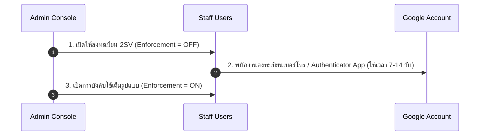

# 🛡️ Google Workspace Security Policy & IoT Server Binding Guide

เอกสารฉบับนี้รวบรวมแนวทางการตั้งค่าผู้ใช้งาน ความปลอดภัยขั้นสูง (2SV) และการออก App Passwords สำหรับเซิร์ฟเวอร์ **Hotel ECS (Raspberry Pi 4)** บนโดเมน `nithep.com` ตามมาตรฐานสากล

---

## 📌 1. การจัดการผู้ใช้และการประหยัดไลเซนส์ (User & Group Management)

| ประเภทการใช้งาน | แนวทางที่ถูกต้อง (Recommended) | ข้อดี / เหตุผล |
| :--- | :--- | :--- |
| **พนักงานโรงแรม (Staff)** | บัญชีรายบุคคลผ่าน `Directory > Users` | เพื่อการระบุตัวตนที่ชัดเจน (Audit Log) และควบคุมสิทธิ์เป็นรายคน |
| **เซิร์ฟเวอร์ IoT (Hotel ECS)** | บัญชีเฉพาะทาง (Dedicated Service Account) เช่น `support@nithep.com` | ปฏิบัติตามหลัก Principle of Least Privilege จำกัดสิทธิ์เท่าที่จำเป็น |
| **อีเมลรับการแจ้งเตือน** | ใช้ **Google Group** (`support@nithep.com`) แทนบัญชีรวม | **ประหยัดค่าใช้จ่าย:** ไม่ต้องซื้อ License เพิ่มเติม สามารถกระจายอีเมลหาพนักงานทุกคนในกลุ่มได้ฟรี |

---

## 🔒 2. นโยบายการยืนยันตัวตนสองขั้นตอน (2-Step Verification / 2SV Policy)

เพื่อป้องกันการแฮกบัญชีและรักษาความปลอดภัยของระบบบริหารจัดการโรงแรม ให้ดำเนินการเปิดใช้งาน 2SV ดังนี้:

### ขั้นตอนการเริ่มเปิดใช้งาน (Phased Rollout Strategy)



1. **ระยะเตรียมการ (Enrollment Phase):** 
   - ไปที่ `Admin Console > Security > Authentication > 2-Step Verification`
   - เลือก **"Allow users to turn on 2-Step Verification"**
   - กำหนด **Enforcement = "Off"** (ให้เวลาพนักงานลงทะเบียน 7–14 วัน)
2. **ระยะบังคับใช้ (Enforcement Phase):**
   - เมื่อพนักงานทุกคนลงทะเบียนเรียบร้อย ให้เปลี่ยน **Enforcement = "On"**

> [!WARNING]
> **ข้อควรระวังเรื่อง Super Admin Lockout:** 
> องค์กรต้องมีบัญชี **Super Admin อย่างน้อย 2 บัญชี** โดยเปิดใช้งาน 2SV ด้วยวิธีที่แตกต่างกัน (เช่น บัญชีที่ 1 ใช้ Security Key / Yubikey และบัญชีที่ 2 ใช้ Google Authenticator App) เพื่อป้องกันเหตุการณ์บัญชีหลักถูกล็อคแล้วเข้าไม่ได้

---

## 🔑 3. การออก App Password สำหรับเซิร์ฟเวอร์ IoT (Hotel ECS)

เนื่องจากอุปกรณ์ IoT / Raspberry Pi 4 ไม่สามารถกดยืนยัน 2SV บนหน้าจอได้ การส่งอีเมล SMTP ผ่าน `backend/services/email_notifier.js` ต้องใช้ **App Password 16 หลัก** โดยมีขั้นตอนดังนี้:

1. ล็อกอินเข้าสู่บัญชี IoT (`support@nithep.com`)
2. ไปที่ [myaccount.google.com/security](https://myaccount.google.com/security)
3. ตรวจสอบให้แน่ใจว่า **2-Step Verification** เปิดใช้งานแล้ว
4. ค้นหาเมนู **"App passwords" (รหัสผ่านแอป)**
5. ระบุชื่อแอปพลิเคชัน: `Hotel-ECS-Pi4`
6. กด **Generate** ระบบจะแสดงรหัสผ่าน 16 หลัก (ตัวอย่าง: `abcd efgh ijkl mnop`)
7. นำรหัสผ่าน 16 หลักไปใส่ในไฟล์ `.env` ของ Backend บน Raspberry Pi 4:

```env
SMTP_HOST=smtp.gmail.com
SMTP_PORT=465
SMTP_USER=support@nithep.com
SMTP_APP_PASSWORD=abcdefghijklmnop
```

---

## 🧪 4. การตรวจสอบระบบและการแจ้งเตือน (Verification)

เมื่อดำเนินการครบทุกขั้นตอน:
- สคริปต์ `email_notifier.js` จะส่งอีเมลยืนยัน Check-in / Check-out ผ่านพอร์ต SSL 465 ได้อย่างสมบูรณ์
- บัญชี `support@nithep.com` จะกระจายอีเมลไปยังผู้รับในกลุ่มโดยไม่ถูกมองว่าเป็น Spam
- ความปลอดภัยของโดเมน `nithep.com` ได้รับการรับรองตามมาตรฐาน Google Workspace Security Defaults

---
*จัดทำเอกสารและตรวจสอบโดย Ant (Senior Software Engineer — SaenBarrel Platform)*
