# 📲 การวิเคราะห์ข้อกำหนดการใช้งาน LINE MINI App In-App Purchase (IAP) ฉบับแก้ไข กรกฎาคม 2569

## 📌 บทนำและภาพรวมของประกาศ
บริษัท LINE (ปัจจุบันอยู่ภายใต้ความร่วมมือของ LY Corporation) ได้ประกาศปรับปรุง **ข้อกำหนดการใช้งานการซื้อภายในแอป LINE (สำหรับผู้ให้บริการแอป LINE MINI) / LINE In-App Purchase Terms of Use (for LINE MINI App Provider)** โดยจะเริ่มมีผลบังคับใช้ในวันที่ **27 กรกฎาคม 2569** ซึ่งเกิดขึ้นหลังจากการเริ่มบังคับใช้ค่าบริการการซื้อภายในแอป (IAP Service Fees) ตั้งแต่วันที่ **1 กรกฎาคม 2569**

> [!IMPORTANT]
> การปรับปรุงครั้งนี้ไม่ใช่เพียงการจัดรูปแบบสัญญา (Formatting) เท่านั้น แต่มีการปรับโครงสร้างขอบเขตความรับผิดชอบทางกฎหมายระหว่างแพลตฟอร์ม LINE และผู้ให้บริการแอป (Provider) ให้มีความชัดเจน เพื่อลดความเสี่ยงและความคลุมเครือหากเกิดกรณีพิพาทด้านการเงิน

---

## 🔍 รายละเอียดการเปลี่ยนแปลงและข้อกำหนดใหม่

### 1. การชี้แจงขอบเขตความรับผิดชอบ (Allocation of Responsibility)
* **ความรับผิดชอบของ Provider:** LINE ระบุชัดเจนว่า Provider (ผู้ให้บริการแอป เช่น โรงแรมหรือผู้พัฒนาระบบ) เป็นผู้รับผิดชอบการซื้อขาย บริการ สินค้าดิจิทัล นโยบายการคืนเงิน (Refund Policy) รวมถึงปัญหาด้านกฎหมาย ข้อร้องเรียน และข้อพิพาทกับผู้บริโภคโดยตรง
* **บทบาทของ LINE:** LINE ทำหน้าที่เพียงผู้ให้บริการระบบส่งผ่านข้อมูลและการชำระเงินทางเทคนิค (Platform Facilitator) จะไม่มีส่วนร่วมหรือรับผิดชอบต่อความเสียหายใดๆ ที่เกิดขึ้นระหว่าง Provider และผู้ใช้งาน

### 2. การเก็บค่าธรรมเนียมบริการ (IAP Service Fees)
* ตั้งแต่วันที่ 1 กรกฎาคม 2569 LINE เริ่มคิดค่าธรรมเนียมบริการ (Service Fees) สำหรับการซื้อสินค้าดิจิทัลหรือบริการเสริมภายใน LINE MINI App (In-App Purchase)
* อัตราค่าธรรมเนียมจะถูกระบุและผูกพันตั้งแต่ขั้นตอนการยื่นเอกสารอนุมัติ (Application phase) โดยจะคิดเป็นเปอร์เซ็นต์ตามส่วนแบ่งธุรกรรม

### 3. ผลผูกพันทางกฎหมาย (Legal Standing)
* ข้อตกลงฉบับ **ภาษาญี่ปุ่น** ถือเป็นสัญญาต้นฉบับที่มีผลทางกฎหมาย (Legally Binding) 
* สัญญาฉบับ **ภาษาอังกฤษ** เป็นเพียงเอกสารแปลเพื่อการอ้างอิงเท่านั้น (Reference translation)
* การให้บริการแอปพลิเคชันและระบบชำระเงินต่อไปหลังวันที่ 27 กรกฎาคม 2569 จะถือว่ายอมรับเงื่อนไขนี้โดยอัตโนมัติ

---

## ⚖️ ความแตกต่างระหว่าง LINE LIFF และ LINE MINI App ในโปรเจกต์ HECS

เพื่อให้เข้าใจผลกระทบอย่างถ่องแท้ ทีมวิศวกรของ HECS ได้จำแนกความแตกต่างระหว่างเทคโนโลยีทั้งสองดังนี้:

| มิติการเปรียบเทียบ | LINE LIFF (ใช้อยู่ในปัจจุบัน) | LINE MINI App (แนวทางอนาคต) |
| :--- | :--- | :--- |
| **ลักษณะการทำงาน** | เปิดหน้าเว็บภายนอก (Frontend React ของเรา) ภายใต้เบราว์เซอร์ของแอป LINE | เว็บแอปพลิเคชันที่รันบนแพลตฟอร์ม LINE โดยมีการจัดทำหน้าร้านและนโยบายเข้มงวด |
| **การตรวจสอบ (App Store Review)** | ไม่ต้องผ่านการตรวจรับรองจาก LINE โดยตรง (เพียงแค่ลงทะเบียน LIFF ID) | ต้องส่งแอปและโมเดลธุรกิจให้ทาง LINE ตรวจสอบและอนุมัติอย่างเป็นทางการ (Verified) |
| **ระบบ In-App Purchase (IAP)** | ชำระเงินผ่าน Gateway ภายนอก (เช่น Stripe, Omise, PromptPay) | ต้องใช้ระบบ IAP ของ LINE MINI App เพื่อจำหน่ายสินค้าดิจิทัล/บริการภายในแอป |
| **ผลกระทบจากข้อกำหนดใหม่นี้** | **ไม่มีผลกระทบ** (เนื่องจากไม่ใช้ระบบ IAP ของ LINE) | **ได้รับผลกระทบเต็มรูปแบบ** ทั้งเรื่องกฎระเบียบและค่าบริการ (Service Fees) |

---

## ⚡ ผลกระทบและข้อเสนอแนะเชิงเทคนิคสำหรับระบบ Hotel ECS (HECS)

### 1. สถานะปัจจุบัน (Current Phase 5 & 6)
* **ผลกระทบ:** **ไม่มีผลกระทบทางตรงต่อการเปิด/ปิดไฟในห้องพัก** 
* **เหตุผล:** ระบบเช็คอินของ Hotel ECS ในปัจจุบันทำงานบน **LINE LIFF App** (ผ่าน `liff-checkin-process` และ `phase5-line-integration`) ซึ่งเป็นเพียงฟังก์ชันการส่ง Webhook / HTTP POST ยืนยันตัวตนว่าแขกมาถึงห้องและส่งสัญญาณทริกเกอร์บอร์ดรีเลย์ ไม่มีการทำรายการซื้อขายสินค้าดิจิทัลในระบบแต่อย่างใด

### 2. สถานะในอนาคต (หากมีการเพิ่มระบบรับชำระเงิน)
หากโรงแรมต้องการขยายความสามารถ เช่น **"การชำระเงินค่ามัดจำกุญแจ, การอัปเกรดประเภทห้องพัก, หรือการสั่งบริการ Room Service/อาหาร"** ผ่าน LINE MINI App ทีมพัฒนาต้องตระหนักถึงเงื่อนไขทางเทคนิคและความปลอดภัยดังนี้:

> [!WARNING]
> **ข้อพิจารณาสำคัญหากตัดสินใจใช้ LINE MINI App IAP:**
> 1. **ต้นทุนที่เพิ่มขึ้น (Cost Overhead):** ต้องคิดคำนวณอัตราส่วนแบ่งรายได้ (IAP Service Fees) ที่ LINE เรียกเก็บเข้าไปในโครงสร้างราคาห้องพัก/บริการเสริม
> 2. **ระบบประนีประนอมยอดเงิน (Payment Reconciliation System):** เนื่องจาก LINE ปฏิเสธความรับผิดชอบในการพิพาท HECS Backend จะต้องเก็บ Log การทำธุรกรรมการจ่ายเงินอย่างละเอียด โดยระบุรหัสธุรกรรม (Transaction ID) และสถานะการเปิด/ปิดไฟ เพื่อป้องกันกรณี "แขกจ่ายเงินแล้วระบบไม่จ่ายไฟเข้าห้อง"
> 3. **ระบบตรวจสอบสิทธิ์ระดับฮาร์ดแวร์ (Hardware-Payment State Verifier):** ต้องขยายความสามารถของ `State_Verifier` ให้ครอบคลุม State การชำระเงิน โดยจะไม่ส่งคำสั่ง "ON" ไปยังตู้สาขา (PBX) จนกว่าจะได้รับสัญญาณ webhook ยืนยันการชำระเงินเสร็จสิ้น (Payment Settled) จาก Gateway
> 4. **การเตรียมสัญญาและกฎหมาย:** โรงแรมต้องมีข้อตกลงและเงื่อนไขการใช้บริการ (Terms of Service) และนโยบายความเป็นส่วนตัว (Privacy Policy) เป็นภาษาไทยและอังกฤษที่รัดกุมเพื่อป้องกันข้อร้องเรียนโดยตรงจากผู้ใช้งาน

---

## 📜 แผนพัฒนาความปลอดภัยเพื่อรองรับในอนาคต (Future Roadmap Plan)

หากระบบ HECS ตัดสินใจพัฒนาส่วนชำระเงินในอนาคต แนะนำให้ใช้สถาปัตยกรรม **Hybrid Payment Gateway** แทนการผูกติดกับ IAP ของ LINE MINI App เพื่อลดภาระค่าธรรมเนียมและเลี่ยงความซับซ้อนทางกฎหมาย:

```mermaid
sequenceDiagram
    autonumber
    actor Guest as แขกผู้พัก (LINE LIFF)
    participant Backend as HECS Backend Server
    participant Gateway as Payment Gateway (e.g., PromptPay/Omise)
    participant PBX as ตู้สาขา Phonik PBX
    
    Guest->>Backend: ร้องขออัปเกรดห้องพัก / สั่ง Room Service
    Backend->>Gateway: สร้างคำสั่งชำระเงิน (Create Charge / PromptPay QR)
    Gateway-->>Backend: ส่งข้อมูล QR Code / ลิงก์ชำระเงิน
    Backend-->>Guest: แสดงผลหน้าจอชำระเงินบน LINE LIFF
    Guest->>Gateway: ชำระเงินสำเร็จ
    Gateway->>Backend: ส่ง Webhook ยืนยันการชำระเงิน (Charge Success)
    rect rgb(30, 40, 50)
        note right of Backend: State Verifier ตรวจสอบและบันทึกลง SQLite (hotel.db)
        Backend->>PBX: ส่งคำสั่งจ่ายไฟ "ON" ไปยังห้องพัก
        PBX-->>Backend: ตอบกลับ ACK (ยืนยันเปิดไฟสำเร็จ)
    end
    Backend-->>Guest: แสดงผลความสำเร็จพร้อมแจ้งเตือนผ่าน Google Chat
```

---
*เอกสารนี้สกัดข้อมูลจากประกาศอย่างเป็นทางการของ LINE Developers เมื่อวันที่ 17 กรกฎาคม 2569*
*จัดทำและกลั่นกรองโดย: Librarian Agent (Antigravity)*
*ตรวจสอบโดย: Verification Agent*
