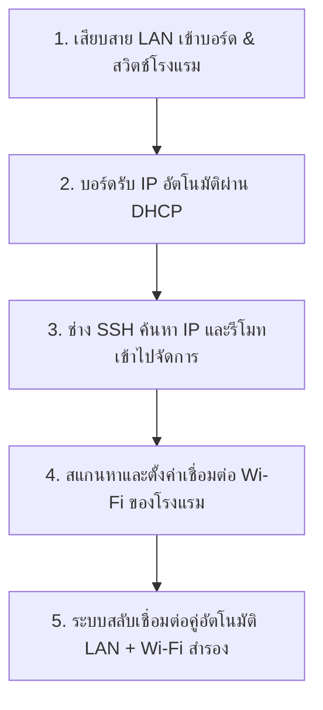

# 🌐 มาตรฐานการจัดเตรียมระบบเครือข่ายสำหรับ Gateway (Network Bootstrapping)

เอกสารนี้นำเสนอแนวทางปฏิบัติที่เป็นมาตรฐานอุตสาหกรรม (Industry Standard) ในการตั้งค่าเครือข่ายสำหรับบอร์ด Raspberry Pi 4 Gateway เพื่อเชื่อมต่อกับระบบโรงแรมและอินเทอร์เน็ต ทั้งการจัดระบบสลับสายอัตโนมัติ (Auto-Failover) และการตั้งค่าจาก LAN ไปสู่ Wi-Fi

---

## 🔄 1. ลำดับขั้นตอนมาตรฐานหน้างาน (Standard Bootstrapping Flow)

ในทางปฏิบัติการติดตั้งระบบฝังตัว (Headless IoT Gateway) ช่างติดตั้งจะไม่เชื่อมต่อหน้าจอที่ตัวบอร์ดหน้างาน ลำดับขั้นตอนมาตรฐานที่ปลอดภัยและง่ายที่สุดคือ:



### 🔌 ขั้นตอนที่ 1 & 2: LAN DHCP Bootstrapping (ต่อแลนเพื่อเปิดระบบ)
* เมื่อเสียบสาย LAN เข้ากับสวิตช์วงเดียวกับระบบโรงแรม ตัวบอร์ด Raspberry Pi 4 จะเปิดอินเทอร์เฟซ `eth0` เพื่อขอ IP Address จาก DHCP Server ของเราเตอร์โรงแรมโดยอัตโนมัติ (เป็นค่าเริ่มต้นของระบบปฏิบัติการ)
* ตัวอย่าง: บอร์ดได้รับ IP `192.168.1.70` จาก DHCP

### 💻 ขั้นตอนที่ 3: การค้นหาและ SSH เข้าไปที่บอร์ด
ช่างสามารถค้นหาไอพีของบอร์ดในวงเน็ตเวิร์กเพื่อรีโมทเข้าไปคอนฟิกได้ผ่าน 2 วิธีมาตรฐาน:
1. **ใช้ mDNS Hostname (สะดวกที่สุด):**
   ```bash
   ssh admin@pi-4.local
   # หรือ ssh admin@pi4.local
   ```
2. **ใช้เครื่องมือสแกน IP (เช่น Advanced IP Scanner):** สแกนหาอุปกรณ์ที่มีผู้ผลิตเป็น "Raspberry Pi Foundation" ในวง `192.168.1.x`

---

## 📶 2. วิธีการตั้งค่า Wi-Fi หลังจากเชื่อม LAN (Wi-Fi Configuration via SSH)

บนระบบปฏิบัติการ **Raspberry Pi OS (Bookworm ขึ้นไป)** จะใช้ **NetworkManager** เป็นตัวจัดการระบบเครือข่ายมาตรฐานหลัก การตั้งค่า Wi-Fi ผ่านคอมมานด์ไลน์ทำได้ง่ายและปลอดภัยดังนี้:

### วิธีการที่ A: ใช้เครื่องมือกราฟิกในเทอร์มินัล (Interactive TUI - แนะนำ)
1. เมื่อ SSH เข้า Pi ได้แล้ว พิมพ์คำสั่ง:
   ```bash
   sudo nmtui
   ```
2. เลือกเมนู **"Activate a connection"**
3. ระบบจะทำการ **สแกนหาคลื่น Wi-Fi (Scan)** รอบตัวโดยอัตโนมัติ
4. เลือกชื่อ SSID (ชื่อไวไฟโรงแรม) -> ใส่รหัสผ่าน (WPA/WPA2 Key) -> กดตกลง

### วิธีการที่ B: ใช้คำสั่งบรรทัดเดียว (CLI Single Command)
1. สั่งเปิดสแกนหา SSID รอบตัวเพื่อเช็คระดับสัญญาณ:
   ```bash
   nmcli device wifi list
   ```
2. เชื่อมต่อเข้ากับ Wi-Fi ที่ต้องการ:
   ```bash
   sudo nmcli device wifi connect "ชื่อไวไฟ_SSID" password "รหัสผ่าน_WIFI"
   ```

---

## ⚡ 3. มาตรฐานการสลับสายแลนและไวไฟอัตโนมัติ (LAN + Wi-Fi Auto Failover)

ในมาตรฐานวิศวกรรมเครือข่าย บอร์ดจะเปิดอินเทอร์เฟซทำงานพร้อมกันทั้ง 2 ตัว (`eth0` และ `wlan0`) โดยระบบจะตัดสินใจเลือกเส้นทางด้วยระบบ **Interface Metric (ลำดับความสำคัญ)**

### 📊 โครงสร้างการลำดับความสำคัญ (Routing Metric):
* **Ethernet (LAN):** จะได้รับ Metric ต่ำกว่า (ความสำคัญสูงกว่า เช่น `100`)
* **Wi-Fi:** จะได้รับ Metric สูงกว่า (ความสำคัญต่ำกว่า เช่น `600`)

```
                          ┌─────────────────────────┐
                          │    มีสาย LAN เสียบอยู่     │
                          └────────────┬────────────┘
                                       │ (Metric 100)
                                       ▼
                       ข้อมูลวิ่งผ่านสาย LAN เป็นหลัก (eth0)
                                       │
                         [เกิดเหตุการณ์สาย LAN หลุด/ขาด]
                                       │
                                       ▼
                     ข้อมูลสลับไปวิ่งผ่าน Wi-Fi (wlan0) ทันที
                         โดยไม่ต้องรีสตาร์ทระบบ (Failover)
```

### 🔒 4. การตั้งค่า IP Address แบบกึ่งคงที่ (Reserved DHCP - แนะนำสำหรับระดับการผลิต)
ถึงแม้ระบบจะรองรับ DHCP แต่สำหรับเซิร์ฟเวอร์ Backend ที่หน้าเว็บและแอป LINE ต้องวิ่งมาหา การปล่อยให้ IP เปลี่ยนไปเรื่อยๆ จะทำให้ระบบล่มในภายหลัง 

**มาตรฐานที่ดีที่สุด (Best Practice):**
* ตั้งค่าบอร์ด Pi 4 เป็น **DHCP** ตามปกติ
* แต่ให้แอดมินระบบเครือข่ายของโรงแรมเข้าไปตั้งค่า **IP Reservation (Static DHCP)** บนหน้าเราเตอร์หลักของโรงแรม โดยผูกหมายเลข **MAC Address** ของบอร์ดเข้ากับ IP ที่กำหนด (เช่น ผูก MAC `88:a2:9e:11:07:fe` ให้ได้รับเฉพาะ `192.168.1.109` เสมอ)
* *ข้อดี:* บอร์ดไม่ต้องแก้ไขไฟล์คอนฟิกภายหลัง และระบบเครือข่ายของโรงแรมไม่เกิดปัญหา IP ชนกัน (IP Conflict)
