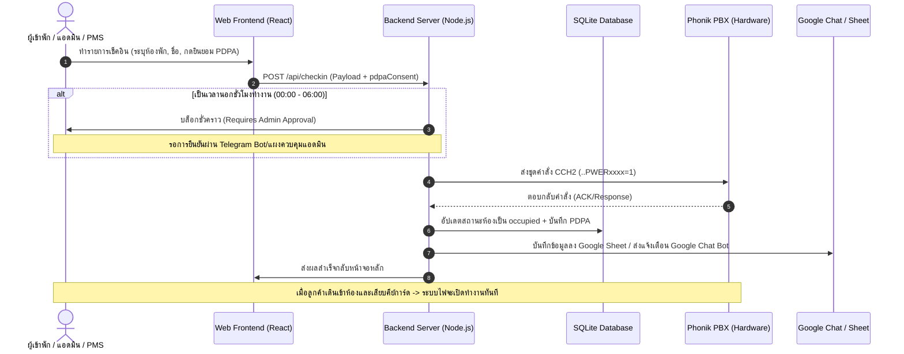

# 📘 ฉากทัศน์การปฏิบัติงานหลัก 3 รูปแบบ (Core Operational Scenarios)

เอกสารนี้รวบรวมและอธิบายขั้นตอนการทำงานอย่างเป็นระบบ (Workflows) ของ **ระบบ Smart Hotel Self Check-in/Check-out** เชื่อมต่อตู้สาขา Phonik PBX เพื่อเป็นคู่มือมาตรฐานในการทดสอบและบำรุงรักษาระบบหน้างานจริง

---

## 🗺️ สรุปภาพรวมความเชื่อมโยงของข้อมูล (Data & Signal Flow)

---

## 📥 ฉากทัศน์ที่ 1: การจองล่วงหน้าและเช็คอินด้วยตนเอง (Pre-Arrival Guest Self Check-in)

เป็นกรณีหลักที่เน้นการลดภาระงานของพนักงานต้อนรับ (Front Desk) โดยให้ลูกค้าทำรายการด้วยตนเองผ่านสมาร์ทโฟน

### ขั้นตอนการทำงาน
1. **การจองและการกระจายลิงก์ (Booking & Link Delivery):**
   - แขกจองห้องพักล่วงหน้าผ่านระบบจองออนไลน์ เมื่อข้อมูลเข้าระบบ แขกจะได้รับลิงก์สำหรับเช็คอิน หรือหน้าล็อบบี้จะมีป้าย QR Code สำหรับสแกนเข้าพาร์ทผู้ใช้งาน (`https://hotel.nithep.com/guest`)
2. **การทำรายการเช็คอิน (Self Check-in & PDPA Consent):**
   - แขกเปิดหน้าระบบบนมือถือ เลือกเลขห้องที่ตนเองจอง กรอกชื่อ-นามสกุล และ**กดยินยอมนโยบายความเป็นส่วนตัว (PDPA Consent Checkbox)** ซึ่งเป็นข้อบังคับตามกฎหมายก่อนส่งข้อมูล
3. **การประมวลผลคำสั่งหลังบ้าน (Backend Processing):**
   - เซิร์ฟเวอร์ตรวจสอบความถูกต้องของข้อมูล จากนั้นส่งสัญญาณดิจิทัล CCH2 Protocol: `..PWER[ROOM]=1\r\n` (เช่น `..PWER0106=1\r\n`) ไปที่ตู้สาขา Phonik PBX ผ่านโปรโตคอล TCP (IP: 192.168.1.91)
4. **การบันทึกสถานะและการแจ้งเตือน (Persistence & Alerts):**
   - อัปเดตตาราง `rooms` ในฐานข้อมูลเป็น `occupied = true` พร้อมบันทึก Timestamp การยินยอม PDPA และเลข IP ของลูกค้า
   - ระบบจะส่งประวัติไปบันทึกที่ Google Sheet และยิงแจ้งเตือนพนักงานผ่าน Google Chat
   - หน้าจอเครื่องควบคุม PC Operator ของทางโรงแรมจะแสดงผลห้องดังกล่าวเป็นสีเหลือง (ไม่ว่าง)
5. **การจ่ายกระแสไฟในห้องพัก (Power Activation):**
   - ตู้สาขาตบสัญญาณไฟไปสับสวิตช์รีเลย์ (Relay Arming) ที่บอร์ด ECS-103R ประจำห้องให้พร้อมทำงาน
   - แขกเดินเข้าห้องพักและ **เสียบคีย์การ์ด** ไฟในห้องพักและระบบปรับอากาศจะสว่างและทำงานทันที

---

## 🚶 ฉากทัศน์ที่ 2: ลูกค้าวอล์กอินหน้างาน (Walk-in at Tablet Kiosk / Staff Assist)

ใช้สำหรับกรณีที่ไม่มีการจองล่วงหน้า แขกเดินเข้ามาขอจองและเช็คอินที่หน้าโรงแรมทันที

### ทางเลือกที่ A: ลูกค้าจองผ่านแท็บเล็ตส่วนกลาง (Kiosk Self Walk-in)
1. ลูกค้าเดินไปที่ตู้แท็บเล็ต Kiosk หน้าเคาน์เตอร์ต้อนรับ ซึ่งเปิดหน้าสแกนทำรายการเช็คอินไว้ ([Scan.tsx](file:///c:/Users/Nithep/%E0%B9%84%E0%B8%94%E0%B8%A3%E0%B8%9F%E0%B9%8C%E0%B8%82%E0%B8%AD%E0%B8%87%E0%B8%89%E0%B8%B1%E0%B8%99%20%28cnithep@gmail.com%29/Hotel-ECS/frontend/src/pages/Scan.tsx))
2. ระบบจะกรองและแสดงเฉพาะ **"เลขห้องพักที่ว่าง"** (`vacant` และกระจ่ายไฟ `OFF`) บนหน้าจอ
3. ลูกค้าเลือกห้องพักด้วยตนเอง กรอกชื่อ และกดติ๊กยินยอม PDPA จากนั้นกด **"ยืนยันและสแกนระบบไฟฟ้า"**
4. เซิร์ฟเวอร์ประมวลผลคำสั่ง เปิดการสแตนด์บายของรีเลย์ห้องพัก พนักงานหน้างานส่งมอบคีย์การ์ดจริงให้ลูกค้าเข้าห้องพัก

### ทางเลือกที่ B: พนักงานทำรายการให้ (Staff Assist Walk-in)
1. พนักงานเปดโปรแกรมแดชบอร์ดหลักของโรงแรม (`https://hotel.nithep.com/dashboard`) บนคอมพิวเตอร์ส่วนกลาง
2. พนักงานกดปุ่ม **"เช็คอิน"** บนกล่องสถานะของห้องพักที่ว่างอยู่ กรอกข้อมูลผู้เข้าพักแทน
3. ระบบจะทำงานและสับไฟรีเลย์ให้เสร็จสิ้นทันทีโดยไม่ต้องผ่านกระบวนการสแกนของลูกค้า

---

## 🔌 ฉากทัศน์ที่ 3: สั่งการผ่านระบบภายนอก (Open API / PMS Integration)

ใช้สำหรับการเชื่อมต่อระบบกับระบบจัดการโรงแรมภายนอก (Third-party Property Management System) หรือ OTAs ระดับโลก เพื่อควบคุมไฟฟ้าและตรวจสอบสถิติแบบอัจฉริยะ

### ขั้นตอนการทำงาน
1. **การอนุมัติและสร้าง API Key (Key Generation):**
   - ผู้บริหารโรงแรม (Owner) เข้าหน้าแดชบอร์ดเมนู *Open API* เพื่อสร้าง API Key เฉพาะระบบ (เช่น ได้รับกุญแจ `sk_ccfe6bb9c767e9b09c565...`)
2. **การส่งคำสั่งจาก PMS (API Request):**
   - PMS ส่งคำสั่งเช็คอินผ่านมายัง Endpoint:
     `POST /api/v1/external/checkin`
     พร้อมแนบ Header `x-api-key: sk_ccfe6bb9c767e9b09c565...`
3. **การกรองด้วยกำแพงความปลอดภัย (Safety & Guardrails):**
   - **Rate Limiter:** จำกัดจำนวนส่งคำสั่งต่อนาทีต่อห้อง เพื่อป้องกันระบบล่มจากการส่งข้อมูลซ้ำซ้อน
   - **Approval Gate (ระบบขออนุมัติภายนอกเวลาทำงาน):** หากคำสั่งถูกส่งเข้ามาในยามวิกาล (หลังเที่ยงคืน 00:00 ถึงหกโมงเช้า 06:00 น.) ซึ่งเป็นช่วงเวลาที่พนักงานประจำเคาน์เตอร์ไม่ได้สแตนด์บาย ระบบจะบล็อกคำสั่งส่งไปยังตู้สาขาทันที และเด้งปุ่มตอบรับความปลอดภัยส่งไปที่ Telegram Bot ของผู้บริหารเพื่อให้ตรวจสอบและกดยืนยัน (Approve) ก่อนสับไฟฟ้าจริง
4. **การตอบกลับและการยืนยันสถานะ:**
   - เมื่อคำสั่งผ่านด่านความปลอดภัยหรือได้รับการกดอนุมัติ ระบบจะส่ง CCH2 Protocol ไปคุมตู้ PBX และตอบกลับสถานะการควบคุมกลับไปยัง PMS พร้อมส่งรหัสติดตามบันทึกธุรกรรม (`trace_id`)

---

## 🧹 ระบบปิดวงจรไฟและทำลายข้อมูลผู้เข้าพักเมื่อเช็คเอาท์ (Check-out & PDPA Data Wipe)

ไม่ว่าจะใช้ฉากทัศน์การเช็คอินแบบใด เมื่อลูกค้าต้องการทำรายการเช็คเอาท์เพื่อเดินทางกลับ:
1. แขกกดปุ่มเช็คเอาท์ผ่านหน้าจอมือถือ หรือพนักงานกดผ่านแดชบอร์ดส่วนกลาง
2. ระบบส่งคำสั่ง CCH2: `..PWER[ROOM]=0\r\n` ไปตัดกระแสไฟของตู้ PBX ทันที (ไฟในห้องจะดับลงทันทีเพื่อการประหยัดพลังงาน แม้เสียบการ์ดทิ้งไว้)
3. **Wipe out:** ข้อมูลชื่อ-นามสกุล, อีเมล, วันเวลาที่ยินยอม, และ IP Address ของลูกค้าท่านนั้นในฐานข้อมูล `rooms` จะถูก**เขียนทับด้วยข้อมูลว่าง (NULL) ทันที** เพื่อความปลอดภัยและการปกป้องข้อมูลส่วนบุคคลตามมาตรการกฎหมายสากล
