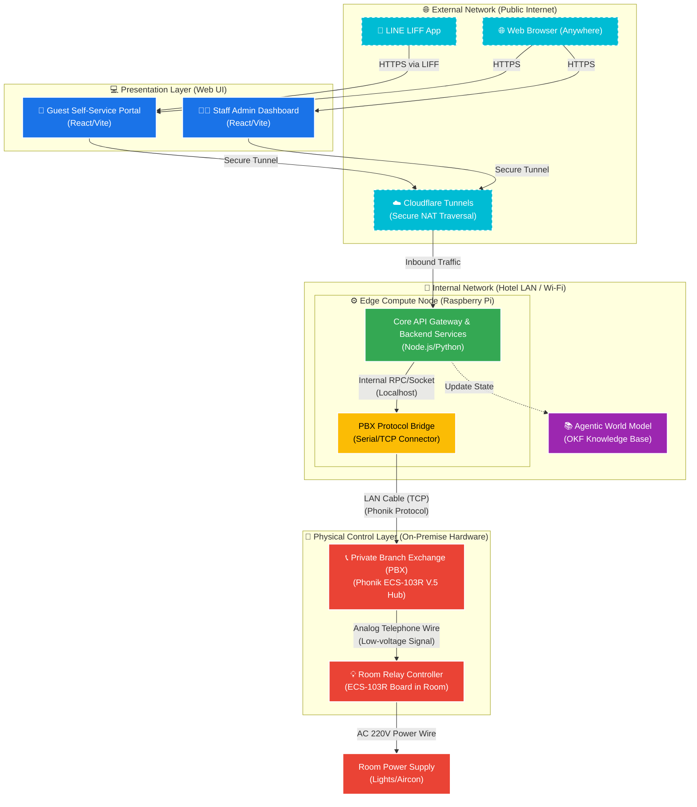

# 🏗️ Phase 6: สรุปโครงสร้างระบบ Hotel-ECS (System Blueprint)

เอกสารนี้สรุปโครงสร้างของระบบ **Hotel-ECS Smart Check-in System** ทั้งหมดอย่างสมบูรณ์ (Phase 6) โดยมีการกำหนดชื่อเรียกแต่ละส่วนประกอบ (Components) ให้สอดคล้องกับมาตรฐานสถาปัตยกรรมซอฟต์แวร์และฮาร์ดแวร์ระดับสากล (International Naming Standards) พร้อมทั้งแผนผัง (Flowchart) การทำงานของระบบ

---

## 🏷️ การตั้งชื่อส่วนประกอบตามมาตรฐานสากล (Standard Component Naming)

เพื่อให้ง่ายต่อการสื่อสารในระดับวิศวกรรมซอฟต์แวร์ เราได้แบ่งระบบออกเป็น เลเยอร์ (Layers) และกำหนดชื่อสากลดังนี้:

### 1. Presentation Layer (ส่วนติดต่อผู้ใช้งาน)
*   **ชื่อสากล:** `Guest Self-Service Portal (SSP)`
    *   **ชื่อเดิม:** Frontend หน้าเช็คอินสำหรับแขก
    *   **หน้าที่:** หน้าเว็บแอปพลิเคชัน (React/Vite) สำหรับให้แขกทำการสแกน QR Code เพื่อทำรายการ Check-in / Check-out ด้วยตนเอง
*   **ชื่อสากล:** `Staff Admin Dashboard`
    *   **ชื่อเดิม:** Frontend ระบบจัดการพนักงาน
    *   **หน้าที่:** หน้าควบคุมและตรวจสอบสถานะห้องพัก สำหรับพนักงานต้อนรับ (Reception)

### 2. Application & Business Logic Layer (ส่วนประมวลผลหลัก)
*   **ชื่อสากล:** `Core API Gateway & Backend Services`
    *   **ชื่อเดิม:** Backend Server (Node.js)
    *   **หน้าที่:** ศูนย์กลางรับส่งข้อมูล (API), จัดการ Business Logic, ตรวจสอบความถูกต้องของการเช็คอิน, และบันทึกข้อมูลลงฐานข้อมูล

### 3. Integration & Hardware Abstraction Layer (ส่วนเชื่อมต่อฮาร์ดแวร์)
*   **ชื่อสากล:** `PBX Protocol Bridge / Hardware Connector`
    *   **ชื่อเดิม:** PBX Connector
    *   **หน้าที่:** Service ย่อย (Microservice/Script) ที่ทำหน้าที่แปลคำสั่งจาก Backend ให้เป็นภาษา/โปรโตคอลระดับล่าง (Serial/TCP) เพื่อสื่อสารกับตู้สาขาโทรศัพท์โดยเฉพาะ

### 4. Edge Infrastructure Layer (โครงสร้างพื้นฐานที่หน้างาน)
*   **ชื่อสากล:** `Edge Compute Node`
    *   **ชื่อเดิม:** Raspberry Pi 4
    *   **หน้าที่:** เซิร์ฟเวอร์ขนาดเล็กที่รันอยู่ภายในเครือข่ายของโรงแรม (Local On-premise) ทำหน้าที่โฮสต์ Backend และ PBX Connector

### 5. Physical Control Layer (ส่วนควบคุมวงจรไฟฟ้า)
*   **ชื่อสากล:** `Private Branch Exchange (PBX)`
    *   **ชื่อเดิม:** ตู้สาขา Phonik PBX
    *   **หน้าที่:** ศูนย์กลางการสื่อสารและกระจายสัญญาณไปยังห้องพักต่างๆ
*   **ชื่อสากล:** `Room Relay Controller (End Node)`
    *   **ชื่อเดิม:** บอร์ด Phonik ECS-103R V.5
    *   **หน้าที่:** แผงวงจรในห้องพักที่รับคำสั่งเปิด-ปิดไฟระดับ 220V (ควบคุมระบบไฟฟ้าในห้อง)

### 6. Cognitive & Documentation Layer (ส่วนความรู้ระบบ AI)
*   **ชื่อสากล:** `Agentic World Model & Digital Twin Base`
    *   **ชื่อเดิม:** ระบบ Docs / OKF Vault
    *   **หน้าที่:** ฐานข้อมูลความรู้ (Knowledge Base) แบบโครงสร้าง (Code as Agent Harness) สำหรับให้ AI Agent ใช้อ่านทำความเข้าใจและพัฒนาระบบต่อ

### 7. Network & Connectivity Layer (ส่วนระบบเครือข่ายและการเชื่อมต่อ)
*   **ชื่อสากล:** `External Network / Public Internet`
    *   **องค์ประกอบ:** LINE LIFF App (สำหรับการเข้าถึงผ่าน LINE), Cloudflare Tunnels (สำหรับการเจาะทะลุ NAT และเชื่อมต่อจากภายนอกอย่างปลอดภัย)
    *   **หน้าที่:** เป็นช่องทางให้แขกและพนักงานเข้าถึงระบบจากภายนอกโรงแรม
*   **ชื่อสากล:** `Internal Network (Local LAN / Wi-Fi)`
    *   **องค์ประกอบ:** Wi-Fi / Ethernet LAN ของโรงแรม
    *   **หน้าที่:** เชื่อมต่อระหว่าง Raspberry Pi (Edge Node) กับ Router ของโรงแรม และอาจรวมถึงการเชื่อมต่อ TCP/IP เข้ากับตู้ PBX (ถ้าตู้รองรับ LAN)
*   **ชื่อสากล:** `Serial / Analog Telecom Network`
    *   **องค์ประกอบ:** สาย RS-232 / สายโทรศัพท์ (RJ11)
    *   **หน้าที่:** สายเคเบิลเชื่อมต่อข้อมูลระดับล่างระหว่าง Raspberry Pi กับตู้ PBX และสายสัญญาณอนาล็อกจากตู้ PBX ไปยังแผงวงจรในแต่ละห้อง

---

## 🗺️ แผนผังการทำงานของระบบ (System Flowchart & Architecture Blueprint)

---

## 🔄 ลำดับขั้นตอนการทำงานหลัก (Core Workflow Sequence)

1.  **Guest Initiation:** แขกเดินทางมาถึงและสแกน QR Code เข้าสู่ `Guest Self-Service Portal`.
2.  **Authentication & Request:** แขกยืนยันตัวตนและกดปุ่ม **Check-in**. `Portal` จะส่ง API request ไปยัง `Core API Gateway`.
3.  **Business Logic Validation:** `Core API Gateway` ตรวจสอบข้อมูลการจอง หากถูกต้อง จะส่งคำสั่งเปิดห้อง (ON) ภายในระบบ.
4.  **Hardware Translation:** `API Gateway` ส่งคำสั่งไปยัง `PBX Protocol Bridge` เพื่อแปลงคำสั่งเป็นภาษาเครื่องระดับล่าง (Phonik Protocol).
5.  **Physical Execution:** `PBX Protocol Bridge` ส่งคำสั่งผ่านพอร์ต LAN ของPBX ไปยัง `Private Branch Exchange (PBX)`.
6.  **Relay Activation:** ตู้ `PBX` ส่งสัญญาณไปยัง `Room Relay Controller` ที่ติดตั้งในห้องพัก เพื่อสั่ง **เปิดวงจรไฟฟ้า (ON)** รอรับการเสียบคีย์การ์ดของแขก.
7.  **Check-out Termination:** เมื่อแขกกด Check-out ผ่านเว็บ, ระบบจะย้อนกระบวนการและสั่ง **ปิดวงจรไฟฟ้า (OFF)** ทันที ตัดไฟในห้องโดยอัตโนมัติ.
