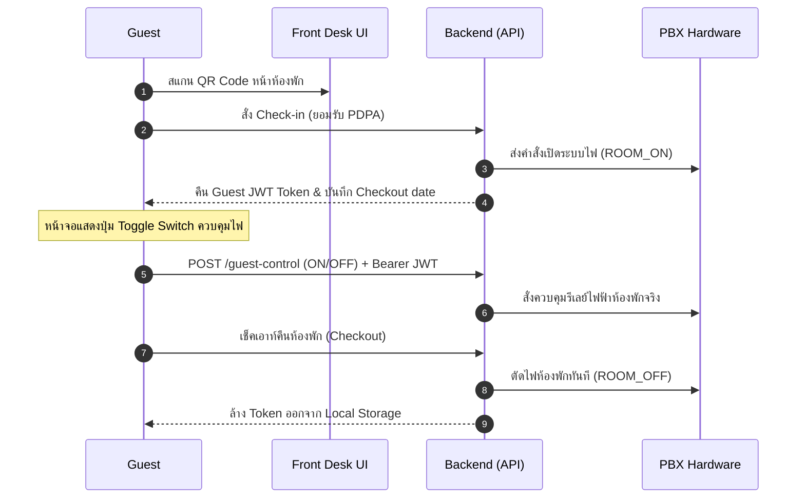

# 🔒 สถาปัตยกรรมการรักษาความปลอดภัยแบบอิงบทบาท (Role-Based Security Design)

เอกสารฉบับนี้อธิบายรายละเอียดโครงสร้างสิทธิ์การเข้าถึง (RBAC) ระบบการปลดล็อก และการปกป้อง API Endpoints ของระบบควบคุมตู้สาขาและระบบไฟฟ้าอัจฉริยะ **Hotel ECS** เพื่อให้ทีมพัฒนาและฝ่ายช่างดูแลรักษาได้อย่างปลอดภัยสูงสุด

---

## 👥 ระดับสิทธิ์ผู้ใช้งาน (User Roles & Permissions)

ระบบแบ่งระดับสิทธิ์ออกเป็น 3 ระดับหลัก เพื่อรองรับการทำงานของโรงแรมและปกป้องฮาร์ดแวร์:

| ระดับสิทธิ์ (Role) | สิทธิ์ทาง API (Backend) | เมนูนำทาง (UI Console) | PIN ปลดล็อก | วัตถุประสงค์การใช้งาน |
| :--- | :--- | :--- | :--- | :--- |
| **Owner** | ดำเนินการได้ทุกคำสั่ง รวมถึง Wi-Fi และ API Keys | แสดงครบทุกแท็บ (Rooms, Approvals, Audit Log, Open API) | `9999` (หรือตามตั้งค่าใน `.env`) | เจ้าของระบบ/วิศวกรดูแลระบบหลัก |
| **Front Desk (Staff)** | ควบคุมเช็คอิน/เช็คเอาท์ และอนุมัติ Bypass คำสั่งเสี่ยง | แสดงเฉพาะแท็บ Rooms และ Approvals เท่านั้น | `1234` (หรือตามตั้งค่าใน `.env`) | พนักงานต้อนรับปฏิบัติหน้าที่หน้าเคาน์เตอร์ |
| **Guest** | ควบคุมระบบไฟฟ้า (ON/OFF) เฉพาะห้องตนเองที่ Check-in | แสดงสวิตช์ Toggle และเวลานับถอยหลังพักอาศัย | ไม่มี (ควบคุมผ่าน Guest JWT Token) | ลูกค้าผู้เข้าพักอาศัยจริงในห้อง |

---

## 🛡️ การรักษาความปลอดภัยในระดับหลังบ้าน (API Protection)

API Endpoints ทั้งหมดได้รับการล็อกด้วยฟังก์ชัน Middleware โดยส่งมอบความมั่นคงผ่าน JSON Web Token (JWT):

```javascript
// ตัวอย่าง Middleware ยืนยันสิทธิ์พนักงานและแอดมินใน backend/server.js
function verifyStaffToken(req, res, next) {
    verifyToken(req, res, () => {
        if (req.user.role !== 'front_desk' && req.user.role !== 'owner') {
            return res.status(403).json({ error: 'Access denied: Staff/Owner authorization required' });
        }
        next();
    });
}
```

### รายละเอียดการจำกัดสิทธิ์ราย Endpoint:
1. **`/api/rooms` (Public):** ดูข้อมูลสถานะไฟและสิทธิ์ห้องพักได้ แต่ข้อมูล Guest details จะถูกลบทิ้งหรือทำให้เป็นนิรนาม (Anonymized) เพื่อให้สอดคล้องกับมาตรฐานคุ้มครองข้อมูลส่วนบุคคล (PDPA)
2. **`/api/checkin` / `/api/checkout` (Staff/Owner):** ป้องกันสิทธิ์การทำรายการโดยใช้พนักงานต้อนรับ
3. **`/api/admin/apikeys` / `/api/wifi/*` (Owner only):** ป้องกันวิศวกรระบบแก้ไขสัญญาณ Wi-Fi หรือ API Keys
4. **`/api/rooms/guest-control` (Guest only):** ปกป้องความถูกต้อง โดยตรวจเช็คความสอดคล้องระหว่าง JWT Token และหมายเลขห้องพักปลายทาง ป้องกันแขกจากห้องอื่นยิงปุ่มข้ามไปปิดไฟห้องเพื่อนบ้าน

---

## 🌐 การควบคุมระบบไฟห้องพักของแขก (Guest Control Flow)

เพื่อความเสถียรและราบรื่น ลูกค้าสามารถปิดไฟจากเตียงนอนหรือควบคุมไฟเมื่อทำรายการเช็คอินผ่าน LINE LIFF ได้โดยตรง:



### การตั้งค่าการบายพาส Approval Gate ของแขก:
ใน [approval_gate.js](file:///c:/Users/Nithep/ไดรฟ์ของฉัน (cnithep@gmail.com)/Hotel-ECS/backend/services/approval_gate.js) แหล่งที่มาการยิงคำสั่ง `'guest_portal'` ได้รับการ Whitelist ใน `APPROVED_FLOW_SOURCES` แล้ว ส่งผลให้แขกสามารถกดเปิด-ปิดสวิตช์ไฟห้องตัวเองได้โดยตรงในทุกช่วงเวลา แม้จะอยู่ในช่วงนอกเวลาทำการปกติ (เที่ยงคืนถึงหกโมงเช้า) โดยไม่โดนบล็อกไปรอคำอนุมัติจากพนักงาน

---

## 🛠️ คู่มือการตั้งค่าสิทธิ์คอนโซลผ่านตัวแปรสภาพแวดล้อม (.env)

ผู้ดูแลระบบสามารถปรับปรุงรหัสผ่านปลดล็อกคอนโซลได้โดยแก้ไขไฟล์ `.env` ที่อยู่บน Raspberry Pi 4 (`/opt/hotel-ecs/config/.env`):

```bash
# พนักงานต้อนรับ (Front Desk)
FRONTDESK_PIN=1234

# ผู้ดูแลระบบหลัก (Owner)
OWNER_PIN=9999

# คีย์ถอดรหัสความปลอดภัย (JWT Secret)
JWT_SECRET=super_secret_hotel_ecs_token_key_103r_v5
```

หลังการปรับปรุง ให้รีสตาร์ทบริการหลังบ้านเพื่ออัปเดตการทำงาน:
```bash
docker compose -f docker-compose.prod.yml restart hotel-app
```
