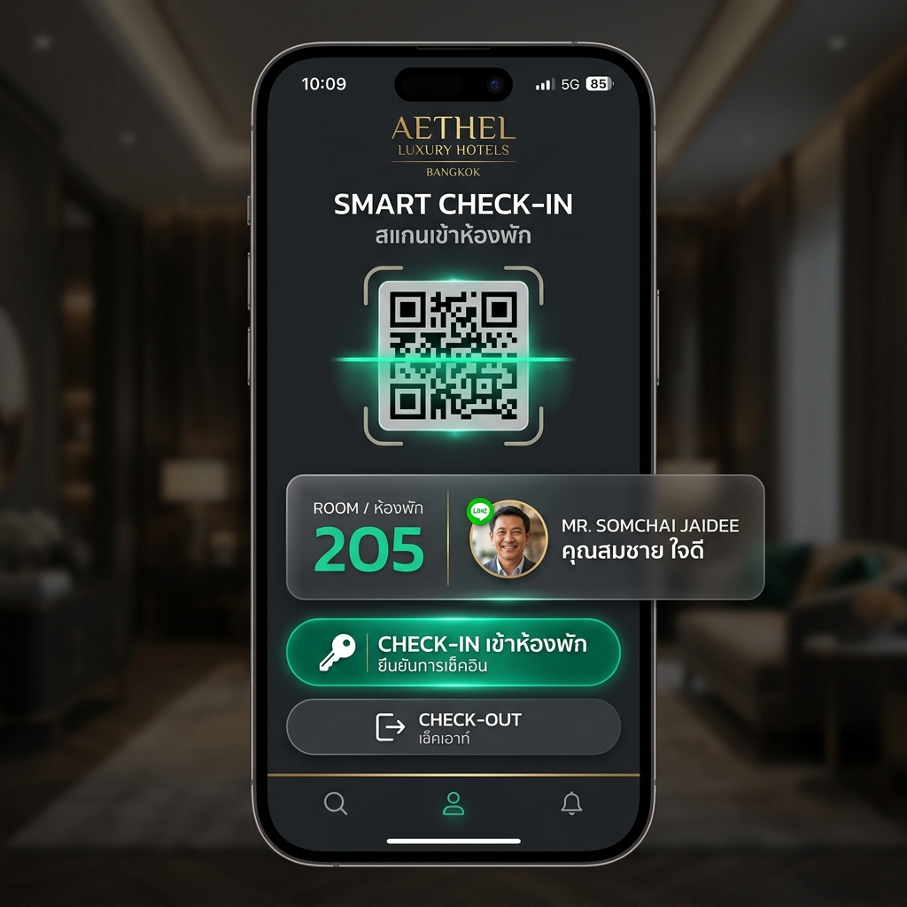
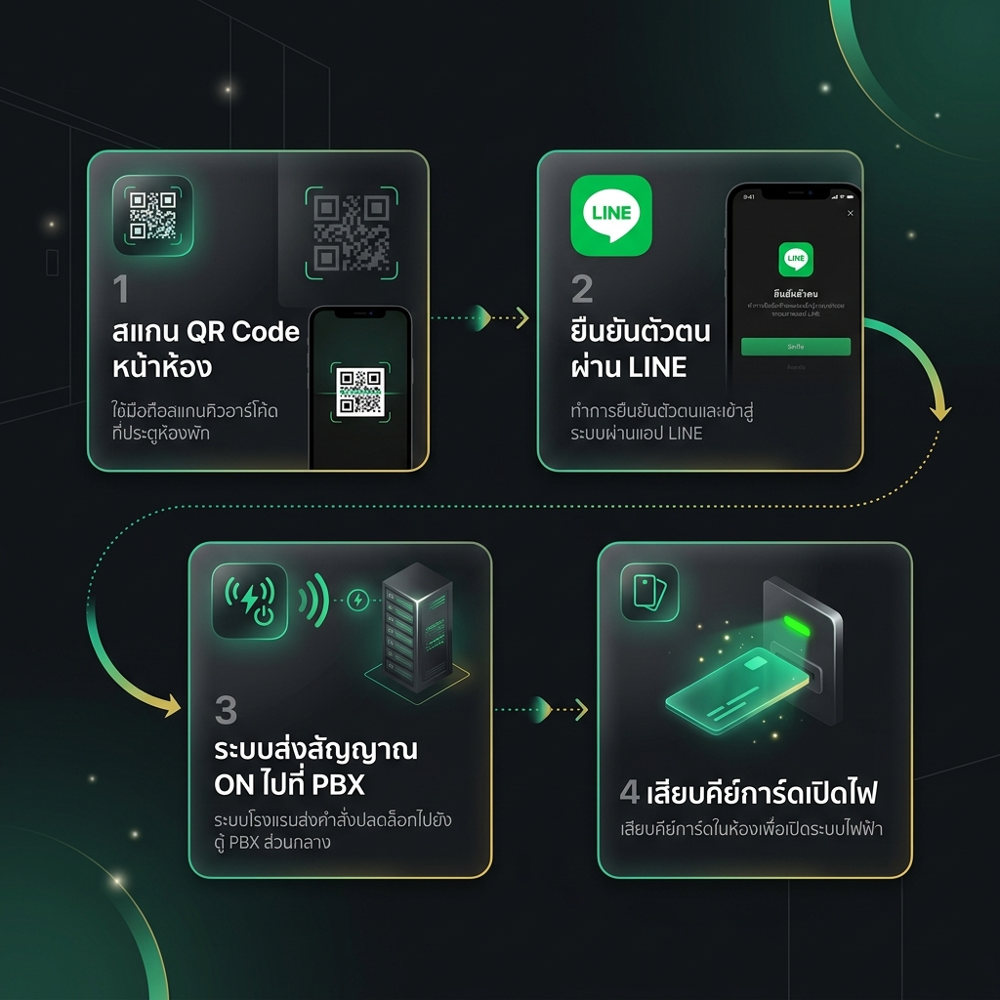
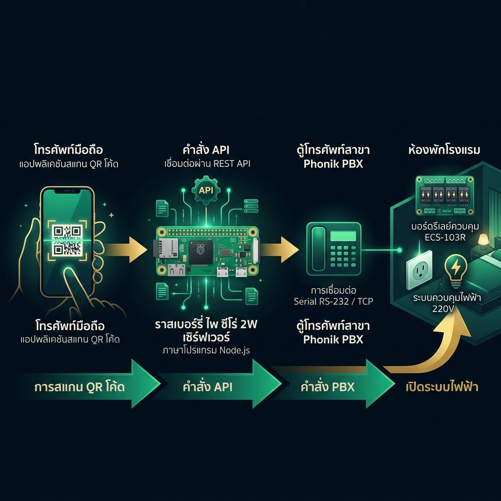

# 🏨 การเปรียบเทียบโมเดลระบบ Smart Hotel Check-in/Check-out

เอกสารนี้วิเคราะห์และเปรียบเทียบแนวคิดการออกแบบระบบ **Self Check-in และ Check-out ด้วย QR Code** เพื่อใช้ควบคุมระบบไฟฟ้าของห้องพัก โดยเชื่อมต่อผ่านบอร์ดควบคุม **Phonik ECS-103R V.5** และตู้สาขา **Phonik PBX** บนระบบปฏิบัติการ **Raspberry Pi 4**

ระบบมีรูปแบบการจำลองการทำงานออกเป็น 3 โมเดลหลักตามวัตถุประสงค์การใช้งานและวิศวกรรมระบบ ดังนี้:

---

## 🗂️ รายละเอียด 3 โมเดลการทำงาน (Detailed Models)

```mermaid
graph TD
    subgraph Model_A [Model A: LINE LIFF Guest-Centric]
        A1[ลูกค้าสแกน QR Code หน้าห้อง] --> A2[เปิด LINE LIFF บนมือถือ]
        A2 --> A3[กด Check-in] --> A4[Backend ส่ง ROOM_ON ไปตู้ PBX]
    end

    subgraph Model_B [Model B: Staff & Kiosk Simulator]
        B1[พนักงาน/Kiosk สแกนบาร์โค้ด] --> B2[หน้าจอจำลอง Animation สแกน]
        B2 --> B3[ผ่านระบบ Safety Pipeline & Rate Limiter]
        B3 --> B4[Telegram Approval Gate ตรวจจับธุรกรรม]
    end

    subgraph Model_C [Model C: Full IoT Digital Twin]
        C1[Database SQLite] <--> C2[State Synchronization Service]
        C2 <--> C3[Raspberry Pi 4 PBX Connector]
        C3 <--> C4[ฮาร์ดแวร์ Phonik PBX via RS-232/TCP]
    end

    classDef modelA fill:#113f15,stroke:#4caf50,stroke-width:2px,color:#fff;
    classDef modelB fill:#3f3711,stroke:#ffeb3b,stroke-width:2px,color:#fff;
    classDef modelC fill:#112a3f,stroke:#2196f3,stroke-width:2px,color:#fff;
    
    class A1,A2,A3,A4 modelA;
    class B1,B2,B3,B4 modelB;
    class C1,C2,C3,C4 modelC;
```

### 1️⃣ Model A: LINE LIFF Guest-Centric (สแกนคิวอาร์โค้ดทางฝั่งลูกค้า)
> [!NOTE]
> **เน้นประสบการณ์ของลูกค้าโดยตรง (Customer Experience)** ลูกค้าทำรายการสแกน QR Code หน้าห้องพักด้วยสมาร์ทโฟนของตัวเอง โดยไม่ต้องดาวน์โหลดแอปพลิเคชันเพิ่มเติม

* **ขั้นตอนการทำงาน**: 
  1. ลูกค้าสแกน QR Code ประจำห้องพัก (เช่น ห้อง 205)
  2. โทรศัพท์เข้าสู่หน้าเว็บ **LINE LIFF app** ผ่านคอมโพเนนต์ [GuestView.tsx](file:///C:/Users/Nithep/Hotel-ECS/frontend/src/pages/GuestView.tsx)
  3. ระบบดึงข้อมูลโปรไฟล์จาก LINE API เพื่อความปลอดภัยและยืนยันตัวตน ลูกค้ากดปุ่ม **"Check-in เข้าห้องพัก"**
  4. Backend ส่งคำสั่ง `ROOM_ON` ไปยัง PBX Connector เพื่อสั่งเปิดรีเลย์ในตู้สาขา 
  5. ระบบไฟในห้องพักพร้อมใช้งานทันทีเมื่อลูกค้าเสียบคีย์การ์ด (ดูโฟลว์ทางเทคนิคเพิ่มเติมได้ที่ [[wiki/liff-checkin-process|กระบวนการเช็คอินด้วย LINE LIFF]])
  6. เมื่อถึงเวลา Check-out ลูกค้าทำรายการกดปุ่ม **"Check-out"** จากมือถือของตนเอง ระบบจะตัดไฟห้องพักทันที

---

### 2️⃣ Model B: Staff & Kiosk Simulator (ระบบจำลองโฟลว์แบบขั้นตอน)
> [!NOTE]
> **ออกแบบมาเพื่อการทดสอบภายใน (Internal Testing) และการใช้งานที่หน้าเคาน์เตอร์ (Staff Kiosk)** เน้นการตรวจสอบความปลอดภัยของขั้นตอนและการควบคุมสิทธิ์เป็นหลัก

* **ขั้นตอนการทำงาน**:
  1. ใช้เว็บจำลองที่หน้า [Scan.tsx](file:///C:/Users/Nithep/Hotel-ECS/frontend/src/pages/Scan.tsx)
  2. แสดงระบบแอนิเมชันจำลองการสแกน (Scanning Animation) และไฟวิ่งแจ้งเตือนสถานะ
  3. คำสั่งเช็คอินจะถูกประมวลผลผ่าน **Safety Pipeline** เพื่อป้องกันอันตรายต่อฮาร์ดแวร์ เช่น:
     - **Rate Limiter**: จำกัดการส่งคำสั่งติดๆ กันเพื่อป้องกันตู้สาขาเสียหาย
     - **Approval Gate**: หากทำรายการนอกเวลาปกติ จะมีการแจ้งเตือนและต้องได้รับการอนุมัติผ่าน Telegram ของผู้บริหารก่อนระบบจึงจะทำงาน (ศึกษาต่อได้ที่ [[wiki/milestones-and-testing|การทดสอบระบบและระบบนิรภัย]])

---

### 3️⃣ Model C: Full IoT Digital Twin (การเชื่อมโยงระบบเครือข่ายและฮาร์ดแวร์จริง)
> [!NOTE]
> **มุ่งเน้นสถาปัตยกรรมระดับวิศวกรรม (Engineering & Hardware Architecture)** แสดงการรับส่งข้อมูลจริงระหว่างแอปพลิเคชัน คลาวด์ และอุปกรณ์ฮาร์ดแวร์ทางกายภาพ

* **ขั้นตอนการทำงาน**:
  1. เน้นกระบวนการประมวลผลคำสั่งในระดับ Low-level ผ่านโปรโตคอล CCH2 (อ่านเพิ่มเติมที่ [[wiki/phonik-pbx-protocol|คู่มือโปรโตคอล Phonik PBX]])
  2. Raspberry Pi 4 รันโมดูล [pbx-connector](file:///C:/Users/Nithep/Hotel-ECS/pbx-connector) เพื่อสื่อสารกับตู้สาขาจริงผ่านพอร์ต LAN ของPBX (TCP) Socket
  3. ระบบทำ **State Synchronization** โดยคอย Sync ข้อมูลสถานะระหว่างบอร์ดควบคุม, ฐานข้อมูล SQLite ของ Backend ([server.js](file:///C:/Users/Nithep/Hotel-ECS/backend/server.js)) และตู้สาขาแบบ Real-time เพื่อให้เกิด Digital Twin ที่จำลองสถานะของห้องพักได้อย่างถูกต้องแม่นยำ (รายละเอียดการตั้งค่าเซิร์ฟเวอร์ที่ [[wiki/raspberry-pi-setup|การตั้งค่า Raspberry Pi]])

---

## 📊 ตารางเปรียบเทียบคุณสมบัติ (Comparison Table)

| คุณสมบัติ | Model A (LINE LIFF) | Model B (Kiosk/Scan Simulator) | Model C (Full IoT Integration) |
| :--- | :--- | :--- | :--- |
| **กลุ่มเป้าหมาย** | แขกผู้เข้าพัก (Guest) | พนักงานต้อนรับ / ทีมทดสอบระบบ | ทีมวิศวกรติดตั้งฮาร์ดแวร์ / ผู้ซ่อมบำรุง |
| **เทคโนโลยีหลัก** | React, LINE LIFF SDK, REST API | React (Framer Motion UI) | Node.js PBX-Connector, SQLite, พอร์ต LAN ของPBX |
| **ระดับความยากในการติดตั้ง** | ปานกลาง (ต้องลงทะเบียน LINE Developer) | ต่ำ (รันและทดสอบบนเว็บบราวเซอร์ได้ทันที) | สูง (ต้องเชื่อมต่อฮาร์ดแวร์และสายสัญญาณจริง) |
| **จุดเด่น** | ประสบการณ์ลูกค้าระดับ Premium ใช้งานง่าย | เหมาะสำหรับเดโมระบบความปลอดภัย / อนุมัติ | จำลองสถานะทางกายภาพ (Digital Twin) ได้เสมือนจริง |
| **ความหรูหราของ UI** | 🟢 สูงมาก (Dark Mode สไตล์โฮเต็ลหรู) | 🟡 ปานกลาง (เน้นโฟลว์การทดสอบ) | 🟡 เน้นการแสดงสถานะและข้อมูลความปลอดภัย |

---

## 🤖 ข้อเสนอแนะเชิงวิศวกรรมในการตัดสินใจ (Senior Engineer Recommendations)

1. **เพื่อประสบการณ์แบบก้าวกระโดดและการสร้าง WOW Factor:**
   👉 แนะนำ **Model A (LINE LIFF)** เป็นทางเลือกหลักสำหรับแขกผู้เข้าพัก เพราะไม่จำเป็นต้องติดตั้งแอปพลิเคชันภายนอก สามารถสแกน สแกนใบหน้า/นิ้วมือบนสมาร์ทโฟนเพื่อยืนยันตัวตน และควบคุมไฟห้องพักได้อย่างลื่นไหลไร้รอยต่อ
2. **สำหรับการอบรมพนักงานและการทดสอบระบบความปลอดภัยหลังบ้าน:**
   👉 แนะนำ **Model B (Scan Simulator)** เนื่องจากช่วยแสดงผลการตรวจสอบอนุมัติการเช็คอินนอกเวลา และระบบป้องกันฮาร์ดแวร์ได้อย่างชัดเจนที่สุด
3. **สำหรับการเดินระบบจริงกับฝ่ายช่างและตรวจสอบฮาร์ดแวร์:**
   👉 แนะนำ **Model C (Full IoT)** เพื่อใช้ทดสอบการตอบสนองของบอร์ด Phonik ECS-103R V.5 ว่าทำงานได้ถูกต้องตรงกับคำสั่งที่ส่งผ่านพอร์ต LAN ของPBX หรือไม่

---
*ความรู้ที่เกี่ยวข้อง:*
- [[wiki/liff-checkin-process|กระบวนการเช็คอินด้วย LINE LIFF]]
- [[wiki/phonik-pbx-protocol|คู่มือโปรโตคอล Phonik PBX]]
- [[wiki/raspberry-pi-setup|คู่มือติดตั้ง Raspberry Pi]]
- [[wiki/milestones-and-testing|การทดสอบระบบและระบบนิรภัย]]
- [[wiki/troubleshooting|คู่มือแก้ไขปัญหาและแจ้งซ่อม]]
