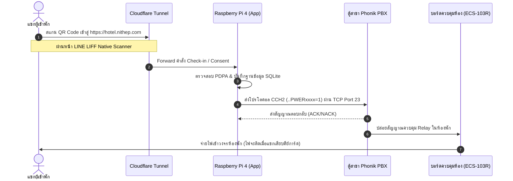

# 📖 คู่มือการใช้งานระบบ Smart Hotel Self Check-in (ฉบับผู้ใช้งานและผู้ดูแลระบบ)

**เอกสารสำหรับ:** พนักงานต้อนรับ (Receptionist), ผู้ดูแลระบบ (System Admin) และคู่มือสำหรับแขก (Guest Guide)  
**เวอร์ชันของระบบ:** 2.5 (Premium UI/UX, RBAC Security, LINE LIFF Native Scanner & Automated Self-Healing)  
**โดเมนบริการจริง:** [https://hotel.nithep.com](https://hotel.nithep.com)

---

## 🏨 1. ภาพรวมระบบและการเชื่อมต่อฮาร์ดแวร์ (System Architecture)

ระบบ **Hotel ECS (Electronic Control System)** ทำหน้าที่เปลี่ยนระบบควบคุมไฟฟ้าแบบเดิมที่รันบนโปรแกรม PC ("Room Manager") ให้กลายเป็น Web Application ที่ทันสมัยบน **Raspberry Pi 4** โดยเชื่อมต่อกับตู้สาขาโทรศัพท์ **Phonik PBX (ECS-103R V.5)** ผ่านระบบเครือข่าย เพื่อควบคุมรีเลย์ไฟฟ้า 220V ในแต่ละห้องพักโดยอัตโนมัติ

### 🔄 แผนผังขั้นตอนการทำงาน (Workflow)

---

## 👩‍💻 2. สำหรับพนักงานต้อนรับและผู้ดูแลระบบ (Hotel Staff & Admin Guide)

ระบบเวอร์ชัน 2.5 ได้รับการรีดีไซน์ในโทนสี **City Blue & Cyber Black Theme** (สไตล์ทีมแมนฯ ซิตี้ เรืองแสงดูล้ำสมัย) พร้อมแอนิเมชันพื้นหลังออโรร่า และใช้สิทธิ์ควบคุมผ่านระบบ **Role-Based Access Control (RBAC)** อย่างเข้มงวด

### 2.1 การเข้าสู่ระบบและระบบสิทธิ์ (RBAC Login)
1. **การเชื่อมต่อจากภายนอกโรงแรม (ไม่ต้องต่อ VPN):** เข้าผ่านลิงก์ [https://hotel.nithep.com](https://hotel.nithep.com)
2. **การเชื่อมต่อในวง LAN โรงแรม:** เข้าผ่าน [http://192.168.1.94:5173](http://192.168.1.94:5173) (หน้าเว็บหลัก) หรือ [http://192.168.1.94:3000](http://192.168.1.94:3000) (Backend API)
3. **ระดับสิทธิ์การใช้งาน (Roles):**
   * **Admin (ผู้ดูแลระบบ):** เข้าถึงหน้าตั้งค่าระบบ, มอนิเตอร์ Log ตู้สาขาแบบสด, สร้าง/เพิกถอน API Key และสั่งขยายเวลาเข้าพักได้
   * **Staff (พนักงานต้อนรับ):** มอนิเตอร์สถานะห้องและสั่งเปิด/ปิดระบบไฟด้วยตนเอง (Manual Override)
   * **Guest (แขก):** เข้าได้เฉพาะหน้าแสดงสิทธิ์, กดยอมรับ PDPA Consent และสแกนสิทธิ์เข้าห้องพักเท่านั้น
   > [!IMPORTANT]  
   > หากพนักงานทั่วไปหรือแขก พยายามเข้าหน้าตั้งค่าของ Admin ระบบจะบล็อกความเข้าถึงโดยอัตโนมัติและแสดงหน้าต่างสีกราฟิก **<Unauthorized />** เพื่อความปลอดภัย

### 2.2 การมอนิเตอร์สถานะห้องพัก (Real-Time Console)
* **สถานะของห้องพัก:**
  * 🔵 **เปิดใช้งาน (Occupied):** ระบบจ่ายไฟเข้าห้อง แขกสามารถเสียบคีย์การ์ดเพื่อเปิดใช้งานแอร์และไฟ
  * ⚪ **ห้องว่าง (Vacant):** ระบบตัดไฟในห้องพักโดยสิ้นเชิง
* **แถบ Terminal Status:** แสดงสถานะการเชื่อมต่อกับตู้ Phonik PBX แบบวิเคราะห์สด หากตู้หลุด (Offline) จะมีไอคอนสถานะสีแดงขึ้นแจ้งเตือนทันที

### 2.3 การสั่งการด้วยตนเองและการขยายเวลาพัก (Manual Override & Stay Extension)
ในกรณีที่แขกทำรายการไม่ผ่าน หรือต้องการต่อเวลาเข้าพัก:
1. ไปที่เมนู **การจัดการห้องพัก** บน Dashboard
2. เลือกหมายเลขห้องพักที่ต้องการควบคุม
3. **การเปิด/ปิดไฟ:** กดปุ่ม **"เปิดระบบไฟ (Check-in)"** หรือ **"ตัดไฟ (Check-out)"**
4. **การต่ออายุการพัก (Stay Extension):** กดปุ่ม **"ต่อเวลาพัก (Extend Stay)"** และระบุวันที่/เวลาใหม่ ระบบจะทำการอัปเดต SQLite และคงสถานะไฟห้องพักของแขกไว้โดยไม่ตัดกระแสไฟเมื่อถึงเวลาเที่ยงวัน

---

## 📱 3. สำหรับแขกผู้เข้าพัก (Guest LIFF Scanner Guide)

ระบบเช็คอินด้วยตนเอง (Self Check-in) ได้รับการปรับแต่งให้สามารถทำงานร่วมกับแอปพลิเคชัน LINE ได้อย่างเป็นธรรมชาติ ผ่านระบบ **LINE LIFF (Vite + React)**

### 3.1 ขั้นตอนการเช็คอินด้วยตนเองของแขก
1. **สแกน QR Code ประจำห้องพัก:** แขกใช้สมาร์ทโฟนสแกนเพื่อเข้าสู่ระบบ
2. **หน้านโยบายข้อมูลส่วนบุคคล (PDPA Consent Screen):** 
   * ระบบจะแสดงหน้าต่างเพื่อขอความยินยอมในการประมวลผลข้อมูลการเข้าพักอย่างปลอดภัย แขกจะต้องกด **"ยอมรับนโยบายความเป็นส่วนตัว (Agree)"** ก่อนดำเนินขั้นตอนต่อไป
3. **ขั้นตอนการเปิดกล้องสแกนใบจอง:**
   * หน้าจอจะแสดงสถานะเตรียมพร้อมกล้อง (`liff_scanning` state) เพื่อแจ้งให้แขกทราบว่าระบบกำลังโหลดโมดูลกล้อง Native ของ LINE
   * หันกล้องไปสแกน QR Code ตั๋วเข้าพัก/ใบจอง
4. **สำเร็จ:** เมื่อสแกนผ่าน ระบบจะส่งคำสั่งเปิดไฟ และหน้าจอจะขึ้นเครื่องหมายติ๊กถูกสีเขียว (Success) ภายใน 1.5 วินาที พร้อมส่งเสียงดัง "แป๊ก" ที่ตู้รีเลย์ห้องพัก

> [!TIP]  
> **ระบบลบข้อมูลส่วนบุคคลอัตโนมัติ (Auto-Eviction Data Policy):** เมื่อแขกทำรายการเช็คเอาท์ ข้อมูลส่วนบุคคล ใบจอง และสิทธิ์กล้องทั้งหมดจะถูกทำลายออกจากฐานข้อมูลทันที เพื่อเป็นไปตามมาตรฐาน PDPA 100%

---

## ⏰ 4. ระบบทำงานอัตโนมัติและการฟื้นฟูภัยพิบัติ (Automated & Recovery SOP)

### 4.1 ระบบตัดไฟเมื่อหมดเวลาอัตโนมัติ (เที่ยงวัน - Auto-Eviction at 12:00 PM)
* ทุกๆ วัน เวลา **12:00 น.** ระบบหลังบ้านที่ทำงานด้วย `node-cron` จะสแกนฐานข้อมูลห้องพักทั้งหมด
* หากพบห้องที่หมดสัญญาเช่าพักในวันนั้น และยังไม่ได้กด "ต่อเวลาพัก (Extend Stay)" ระบบจะส่งคำสั่ง **ตัดระบบไฟ (OFF)** ไปยังตู้สาขาทันที เพื่อช่วยประหยัดพลังงานไฟฟ้ารวมของโรงแรม

### 4.2 ระบบกู้คืนระบบไฟฟ้าหลังไฟดับ (Cold Boot Power Recovery)
* หากเกิดเหตุการณ์ไฟฟ้าดับทั้งโรงแรม บอร์ด Raspberry Pi 4 และตู้สาขาจะดับไปพร้อมกัน
* เมื่อระบบไฟฟ้ากลับมาทำงานปกติ (Power Recovery):
  1. เครื่อง Raspberry Pi 4 จะบูตตัวเองขึ้นมาอัตโนมัติ
  2. สคริปต์กู้คืน (`state_verifier` / PM2 auto-boot) จะสแกนฐานข้อมูล SQLite ในเครื่องทันที
  3. ระบบจะยิงคำสั่ง **เปิดไฟ (ON)** คืนให้กับทุกห้องพักที่ยังมีสถานะเช็คอินค้างอยู่ในระบบ (และยังไม่หมดสัญญาเช่าพัก) ไปยังตู้ PBX โดยอัตโนมัติ แขกในห้องจะใช้งานไฟฟ้าได้ต่อเนื่องโดยที่พนักงานไม่ต้องกดเปิดไฟให้ใหม่ทีละห้อง

---

## 🚨 5. การแก้ไขปัญหาสำหรับพนักงานต้อนรับ (Troubleshooting Guide)

> [!WARNING]  
> **หากเกิดกรณีฉุกเฉิน หน้าจอค้าง หรือตัวเว็บแสดงข้อผิดพลาด**

| ปัญหาที่พบ | สาเหตุที่เป็นไปได้ | แนวทางแก้ไขสำหรับพนักงาน (SOP) |
| :--- | :--- | :--- |
| **หน้าจอมือถือแขกแสดงจอดำขณะสแกน** | แขกใช้เบราว์เซอร์โหมดส่วนตัว (Incognito) หรือไม่ได้กดยอมรับการเปิดสิทธิ์กล้อง | แนะนำให้แขกกดปิดหน้าต่างแล้วสแกนใหม่ หรือเปลี่ยนมาใช้แอปพลิเคชัน LINE ปกติ ระบบจะเปิดระบบเปิดกล้อง Native ให้โดยอัตโนมัติ |
| **ไอคอน PBX แดงแจ๋ / สั่งเปิดไฟแล้วไม่ติด** | 1. สาย LAN ระหว่างตู้ Phonik PBX กับ Switch/Router หลุด 2. คิวคำสั่งบนตู้สาขาเกิดปัญหาคอขวด | 1. ให้พนักงานหรือช่างไฟเดินไปตรวจเช็คพอร์ต LAN หลังตู้สาขา 2. หากระบบหน่วง สคริปต์ **Queue Timeout** ของตัวเชื่อมต่อจะดักจับและเคลียร์คำสั่งที่ค้างอยู่ภายใน 5 วินาทีโดยอัตโนมัติ ให้รอสักครู่แล้วกดสั่งเปิดไฟใหม่อีกครั้ง |
| **เครื่อง Pi4 ดับ หรือเปลี่ยน IP ไป** | ตัวเครื่อง Pi ดับไปหรือ IP ฝั่ง LAN เปลี่ยนแปลงเนื่องจาก DHCP | ตัวเครื่องได้รับการติดตั้ง **Cloudflare Tunnel** แบบถาวร ซึ่งจะสร้างโดเมนจำลองที่เชื่อมต่อตรงกับตัว Docker container ตราบใดที่ Pi4 มีอินเทอร์เน็ต พนักงานสามารถใช้งานลิงก์ [https://hotel.nithep.com](https://hotel.nithep.com) ได้ตลอดเวลาโดยไม่ต้องคำนึงถึงเลข IP อีกต่อไป |
| **หน้าจอขึ้นกรอบ "Premium Error Boundary"** | มีการชนกันของข้อมูลหรือการประมวลผล Frontend ผิดพลาดชั่วคราว | ไม่ต้องตื่นตกใจ ให้กดปุ่ม **"รีโหลดหน้าคอนโซล (Reload Console)"** สีฟ้าในกรอบเตือนทันที หน้าจอจะคืนค่าสถานะและซิงค์ใหม่กับฐานข้อมูลหลังบ้านอัตโนมัติ |

---
*จัดทำและปรับปรุงโดย: AI Engineering Team (Antigravity)*  
*อัปเดตล่าสุด: 21 กรกฎาคม 2026 (ระบบ Smart Hotel Self Check-in v2.5)*
