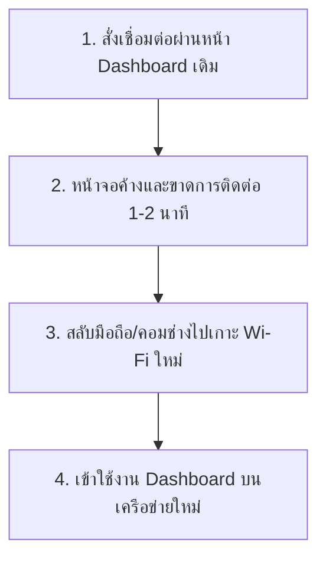

# 📶 คู่มือการปฏิบัติงานเปลี่ยนเครือข่าย Wi-Fi สำหรับโหมด Wi-Fi Only

คู่มือฉบับนี้จัดทำขึ้นสำหรับ **ทีมช่างติดตั้งและผู้ดูแลระบบ** เพื่อใช้เป็นมาตรฐานการทำงานเมื่อจำเป็นต้องตั้งค่าหรือย้ายเครือข่ายของบอร์ด Raspberry Pi 4 Gateway ที่ใช้งานผ่านสัญญาณ **Wi-Fi เพียงอย่างเดียว (ไม่มีการต่อสาย LAN)** ซึ่งจะมีผลกระทบเรื่องการขาดการเชื่อมต่อชั่วคราวระหว่างเปลี่ยนผ่านเครือข่าย

---

## ⚠️ ปรากฏการณ์หน้างานที่จะเกิดขึ้น (What to Expect)
เมื่อสั่งเชื่อมต่อ Wi-Fi เครือข่ายใหม่ในโหมด Wi-Fi Only บอร์ด Pi 4 จะต้องสั่งตัดการเชื่อมต่อกับเราเตอร์ตัวเดิมชั่วคราว ส่งผลให้ **หน้าเว็บ Dashboard จะค้างและหลุดจากการเชื่อมต่อทันที** ซึ่งเป็นเรื่องปกติของระบบเครือข่ายไร้สายเดี่ยว (Single Wireless Interface)

---

## 📋 ขั้นตอนการปฏิบัติจริงทีละขั้นตอน (Step-by-Step Action Plan)

### ขั้นตอนที่ 1: การสั่งเชื่อมต่อเครือข่ายใหม่
1. เชื่อมต่อคอมพิวเตอร์/มือถือเข้ากับ Wi-Fi เดิมที่บอร์ดต่ออยู่ และเปิดหน้าแดชบอร์ด
2. ไปที่เมนู **Wi-Fi** สแกนหาชื่อสัญญาณใหม่ (SSID Target)
3. คลิกเลือกเครือข่ายใหม่ ใส่รหัสผ่าน WPA Key ให้ถูกต้อง
4. กดปุ่ม **"เชื่อมต่อเครือข่าย"** (Connect) 

### ขั้นตอนที่ 2: ช่วงเปลี่ยนผ่าน (Wait for Transition)
* หลังจากกดเชื่อมต่อ หน้าเว็บจะขึ้นสัญลักษณ์กำลังหมุน หรือตัดการเชื่อมต่อ (เนื่องจากบอร์ดปิดคลื่นเพื่อไปจับเครือข่ายใหม่)
* **ข้อปฏิบัติ:** ให้ปิดหน้าเว็บบราวเซอร์นั้นลงทันที และ **รอประมาณ 60 - 90 วินาที** เพื่อให้ระบบปฏิบัติตนและสั่งงานขอหมายเลข IP ใหม่จากเราเตอร์ตัวใหม่สำเร็จ

### ขั้นตอนที่ 3: สลับเครือข่ายบนเครื่องมือช่าง
* ช่างติดตั้ง/ผู้ใช้งานต้องเข้าเมนู Wi-Fi ในโทรศัพท์มือถือ หรือโน้ตบุ๊กของตนเอง และ **เปลี่ยนไปเชื่อมต่อเครือข่าย Wi-Fi ใหม่** (ตัวเดียวกับที่เลือกให้บอร์ดในขั้นตอนที่ 1)

### ขั้นตอนที่ 4: การเข้าใช้งาน Dashboard อีกครั้ง (3 ทางเลือก)

เพื่อเข้าสู่หน้าจอควบคุมหลังจากย้ายเครือข่ายเสร็จสิ้น สามารถทำได้ผ่านช่องทางดังนี้:

| วิธีการเชื่อมต่อ | ช่องทางการเข้า (URL) | เหมาะสำหรับ | ข้อดี |
| :--- | :--- | :--- | :--- |
| **วิธีที่ A: ใช้ Hostname (mDNS)** *(แนะนำที่สุด)* | **`http://pi-4.local:3000`** | อุปกรณ์ Apple, Windows 10/11, และ Android รุ่นใหม่ | ไม่ต้องตามหาหมายเลข IP ใหม่ ระบบจะค้นหาเครื่องเองอัตโนมัติในวงเดียวกัน |
| **วิธีที่ B: ผ่านอินเทอร์เน็ตภายนอก** | **`https://hotel.nithep.com`** | การตั้งค่าภายนอก หรือผ่าน Cloudflare Tunnel | เข้าได้จากทุกที่ทั่วโลกทันทีที่บอร์ดเชื่อมต่อเน็ตสำเร็จ ไม่ต้องอยู่ในวงแลนเดียวกัน |
| **วิธีที่ C: สแกนหาไอพีใหม่** | **`http://<IP_ใหม่_ที่ได้จากเราเตอร์>:3000`** | กรณีอุปกรณ์ไม่รองรับ mDNS และไม่มีเน็ตออกนอก | ใช้แอปพลิเคชันสแกนไอพี เช่น *Fing* หรือ *Advanced IP Scanner* ค้นหาอุปกรณ์ชื่อ "Raspberry Pi" ในวงแลนใหม่ |

---

## 🛠️ วิธีการกู้คืนระบบกรณีรหัสผ่านผิดพลาด (Self-Healing & Recovery Flow)
หากช่างติดตั้งป้อนรหัสผ่าน Wi-Fi ใหม่ผิดพลาด บอร์ด Pi 4 จะพยายามเชื่อมต่อไม่สำเร็จและส่งผลให้หลุดการเชื่อมต่อจากทั้งสองเครือข่าย

**กลไกการกู้คืนความเสถียร (Fallback Mechanism):**
1. ระบบปฏิบัติการ NetworkManager บนบอร์ด Pi 4 จะพยายามเชื่อมต่อเครือข่ายใหม่ตามช่วงเวลา Timeout (ประมาณ 25-30 วินาที)
2. หากไม่สำเร็จ บอร์ดจะทำการ **Rollback (สลับกลับมาเกาะ Wi-Fi ตัวเก่าที่เคยเชื่อมต่อสำเร็จล่าสุด) โดยอัตโนมัติ**
3. **การปฏิบัติหน้างาน:** ให้ช่างเปลี่ยน Wi-Fi ของเครื่องมือตัวเองกลับมาที่วงเดิม และเข้า URL เดิมเพื่อสั่งเชื่อมต่อใหม่อีกครั้งด้วยรหัสผ่านที่ถูกต้อง
